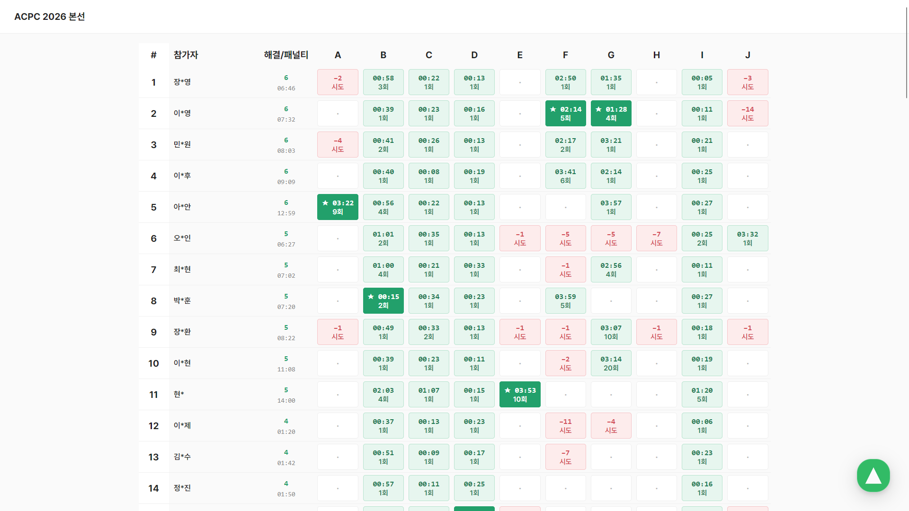

작년에 이어 올해도 코드트리에서 주최하는 ACPC에 참가했다. 예선은 또 COEIC으로 진행했는데, 딱히 쓸 좋은 말이 없고 나쁜 말은 쓰고 싶지 않아 후기는 생략한다.

대회장은 AWS코리아의 본사였다. 보안이 철저한 건물이라 그런지 작년에 입구를 찾기 어려웠던 기억이 있었다. 올해는 그 경험을 토대로 빠르게 찾아갈 수 있었고 solved.ac 디스코드에서 다른 참가자들에게 오는 길을 알려주기도 했다. 대회 시작 전에는 `parkky`, `azberjibiou`, `mon_de2738`, `moonrabbit`, `fefe` 등 KAIST 사람들과 놀았고, 흔치 않은 오프라인 대회라 그런지 `annyeong1`, `qwerasdfzxcl`, `leo020630`, `kolorvxl` 등 고수들도 보였다. 대충 기웃거리다 보니 인터뷰도 했다. 준비된 간식으로는 찰떡파이(우베크림치즈맛), 촉촉한 초코칩(옥수수맛), 초코파이(망고라씨맛), 후레쉬베리(펑리수맛) 등이 있었는데, 누구의 취향인지 조금 궁금했다.

작년에는 나름 실력에 대한 자신감을 갖고 갔다가 영혼까지 털리고 돌아온 기억이 있기에, 이번에는 사실 딱히 기대를 하지 못했다. 10문제에 4시간이고 서브태스크까지 없다면 작년처럼 순위권과는 최소 2솔브, 1등과는 한 3솔브쯤 차이가 날 것이라고 예상했기 때문이다.

## AC 타임라인

### 00:13

문제가 난이도순이 아니라길래 일단 아주 빠르게 관상부터 훑었다. 그러다가 D가 눈에 들어왔다. 격자의 일부 칸이 비어 있고, 한 번 이동을 시작하면 벽에 부딪히기 전까지는 방향을 바꿀 수 없는 세팅에서 두 점 사이의 최단 경로를 구하는 문제였다. 보통은 인접한 칸끼리 이동하는 0-1 BFS나 다익스트라 등을 사용한 것 같던데, 나는 각 빈 칸에 대해 상하좌우로 출발했을 때 결국 도달하게 되는 칸을 미리 구해두고 그렇게 만들어진 가중치 그래프에서 다익스트라를 돌렸다. 그래서 남들보다 살짝 오래 걸린 것 같다.

### 00:25

스코어보드에서 I가 매우 빠르게 풀리길래 읽었다. 큐브의 각 면에 체스판 색칠을 하고 도미노를 놓고 어쩌고저쩌고하는 문제였는데, 풀리는 시간대와 문제의 관상을 종합하니 n에 대한 간단한 식으로 답이 나옴을 추측할 수 있었다. 적당히 그림을 그려보다가 예제와 맞는 식이 나와서 제출했다. n이 99999 이하였나 그랬는데 n을 int로 받고 `n * n`을 계산하는 바람에 한 번 WA를 받고 AC.

### 00:35

스코어보드를 따라 C로 이동했다. 처음에는 살짝 어려운가 싶었는데 extra vertex를 도입하여 MST를 구하는 문제로 환원이 가능했다. 이 문제를 작년에 이화여대였나 디미고였나 하는 대회에서도 보고, 최근에도 뭔가 큰 대회에서 한 번 본 것 같은데 살짝씩 다른 세팅으로 같은 문제를 이렇게 많이 본 건 처음인 것 같다. 빠르게 구현해서 AC.

### 01:01

스코어보드에서 다른 문제는 전혀 솔브가 없었고, B 솔브만 조금 볼 수 있었다. B는 대충 트럭의 시작점과 도착점 후보를 매칭해서 어쩌고저쩌고하는 문제였는데, 매칭을 명시적으로 생각할 필요 없이 앞에서부터 보면서 각 시점에 매칭이 열릴지 닫힐지만 고려하면 된다는 것을 관찰할 수 있었다. 이를 토대로 자명한 제곱 DP를 짜면 MLE가 나온다. 많은 사람들이 당했던데, 메모리 제한이 64MB로 빡빡해서 마지막 두 행만 저장하는 메모리 최적화가 필요했다. 고쳐서 AC.

### 03:32

B까지 풀고 나니 한동안 스코어보드에서 AC가 나오지 않았다. 참가자 리스트를 생각했을 때 플2 이하의 문제가 다 사라졌다고 생각했다. 그래서 일단 모든 문제를 읽어보았고, G와 J에서 유의미한 관찰을 할 수 있었다. G는 트리가 어쩌고저쩌고하는 세팅은 전부 연막이고, 그냥 수열에서 구간에 수를 XOR하는 쿼리가 주어질 때 전체 수열이 만드는 XOR basis를 관리하는 문제임을 관찰할 수 있었다. J는 어려운 기하 같지만 한 x좌표당 y좌표가 unique하게 존재하는 선분 집합 3개의 위쪽 껍질을 구하기만 하면 되는 문제임을 관찰했다. 둘 다 아주 못할 문제는 아니지만 선형대수학보다는 기하 문제를 훨씬 많이 풀었기에 J를 잡는 것이 더 안정적이라고 판단했다.

대충 1시간 30분쯤 걸릴 것을 예상했는데, 생각보다 구현에 실수가 많아 2시간 30분쯤이 걸렸다. 중요한 수식 등은 오류 없이 한 번에 잘 썼는데, long double형이었던 수가 슬쩍 long long에 담겨 버린다든가 하는 말도 안 되는 실수가 많았다. 그래도 예제가 모두 돌게 되었을 때 제출하니 바로 AC.

### 04:00

J에서 AC를 받고 나니 스코어보드에서 수많은 4솔브 참가자들이 프리즈 이후에 제출을 한 모습을 볼 수 있었다. 특히 F와 G에 제출이 많았기에 좀 열심히 잡으면 풀 만한 문제인가 보다 싶었고, 나는 초반 패널티 관리도 별로였고 J를 상당히 늦게 풀었기에 높은 등수는 어렵겠구나 싶었다. 또 시간이 30분밖에 남지 않아 딱히 할 수 있는 것이 없다고 판단해서, E, F, G, H에 각각 1, 5, 5, 7번의 WA 제출을 내면서 놀았다.

그런데 생각보다 시간이 느리게 가서, 10분쯤 놀다가 그냥 G라도 짜기 시작했다. 늘 짜던 레이지세그라서 main과 세그 템플릿은 생각보다 금방 완성했고, XOR basis에 원소를 추가하는 핵심 함수 정도만 남은 상태로 대회를 종료했다. $900Q\log{N}$ 정도의 시간에 동작하는 코드였기에 완성해도 TLE가 날 가능성이 높았지만, 데이터가 약할 수 있기에 놀았던 10분이 아쉬워졌다.

## 후기

예상보다 훨씬 높은 등수인 6등을 기록했다. 대회가 끝난 직후에 들은 점수 중에 1, 2, 5등의 점수가 있었어서 5솔브가 아주 많을 줄 알았는데, 의외로 5솔브 중 1등을 하게 되었다. J를 느리게 풀긴 했지만 한 번에 AC를 받은 것이 컸던 것 같다. 그리고 역시나 최종 솔브 수를 봐도 4문제를 제외하면 solved.ac 기준 다이아 이상의 난이도를 가졌구나 싶었다. 그런 와중에 기하가 나와줬고, 빠르게 잡은 것이 좋은 결과의 원인인 것 같다.

대회 중간중간에 운영 이슈로 실행이 안 되었다거나, `long long` 때문에 WA를 받았다거나 하는 일들이 있었는데, 5솔 탑이어서 패널티가 좋아져봤자 의미가 없다. 그래서인지 아주 상쾌한 기분이다. 등수가 올라가려면 사소한 실수를 덜 해서 시간을 벌고 J 솔브 이후로 놀지 말고 바로 G를 잡은 후에 한 번에 구현에 성공하고 $900Q\log{N}$ 풀이가 시간 내에 돌아야 하는데, 그런 세계선은 이런 대회보다는 더 좋은 곳에서 나와주는 게 좋을 것 같고, 애초에 그래봤자 딱히 수상권으로 등수가 오르지도 않는다.

대상은 룸메이트이자 ICPC 팀원인 [azberjibiou](https://azber.tistory.com/62)가 수상했다. 이게 ICPC 셋이라고 치면 azberjibiou가 버스를 빠르게 몰고 남는 시간에 내가 J를 짜서 맞으면 되니 상당히 긍정적인 시그널이라고 느꼈다.

백준이 섭종하고 태그별로 문제를 푸는 것이 어려워져서 최근에 기하 문제를 좀 덜 풀었는데, 딱히 돌 일 없는 옛날 ICPC 셋에서 기하들을 쏙쏙 빼먹으면서 공부를 해야 하나 싶다.
