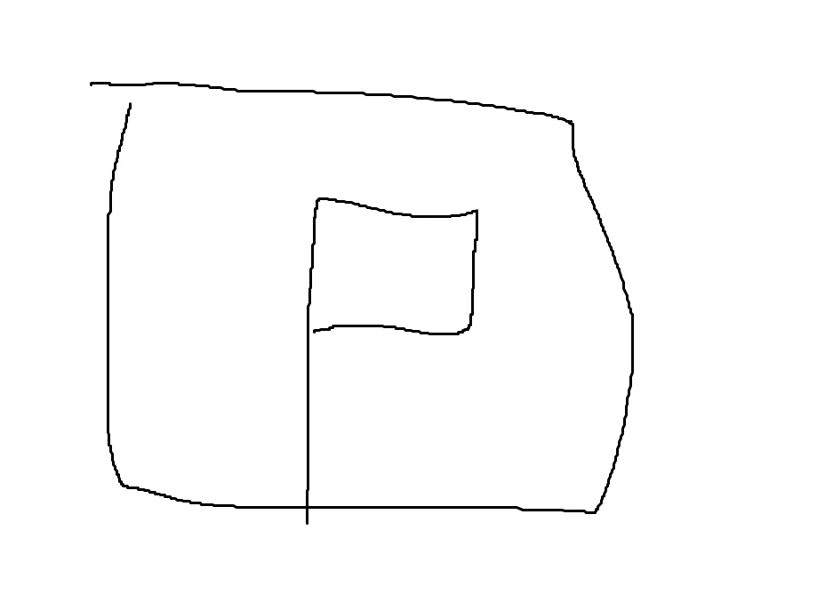

올해 ICPC 팀원은 octane, abra_stone, cywohoy이다. 서울 인터넷 예선 이후 조금의 팀연습과 많은 개인 연습을 통해 팀원 역할 분배를 아래와 같이 확정했다.

octane: 플래 이하의 모든 문제를 푼다. 이후 기하 / 플로우 / 문자열 등의 다이아를 잡는다.

abra_stone: 플래 이하에서 octane이 못 푸는 문제를 푼다. 이후 DP / 그리디 등의 다이아를 잡는다.

cywohoy: 다이아 상위 이상의 수학 문제가 나오면 푼다.

\+ 자료구조와 그래프 다이아는 octane과 abra_stone이 회의(보통 싸운다)를 통해 풀어낸다.

이렇게 정해진 이유는 예선 후기글에도 서술했듯 팀원 3배럭보다 부담감을 가진 octane의 1배럭이 플래 이하를 푸는 속도가 더 빨랐기 때문이다. 허나 상대적으로 MZ한 PS러인 octane이 종종 슼보에서는 한참 풀린 든든한 국밥같은 DP나 그리디 등에서 말리는 경우가 종종 있었다. 바로 이럴 때 2018년 KOI 대상 수상자 abra_stone이 등장하는데, 놀랍게도 octane이 못 푸는 문제만 쏙쏙 골라서 잘 푸는 모습을 보여주었다. cywohoy의 경우 2025 Taichung Regional의 G(<https://codeforces.com/contest/2172/problem/G>)를 보고 바로 Todd-Coxeter라는 사실을 알아내는 등, 한 번만 주사위 7을 띄워준다면 압도적 우위를 점할 수 있는 잠재력이 있었다. RUN 가을대회에 나온 ibm2006맛 투스텝 문제(<https://www.acmicpc.net/problem/34660>)도 답에 거의 근접한 관찰을 했는데, 내가 L 디버깅에 실패해 끝까지 풀지는 못하고 대회가 끝난 후에 업솔빙을 한 것으로 알고 있다. 아무튼 대충 '이걸 누가 풀어' 싶은 수학 문제가 나온다면 cywohoy에게 넘기기로 했다.

## 2025 ICPC Asia Seoul Regional Contest

별로 잘 친 대회도 아니고, 문제의 풀이를 궁금해할 사람도 없을 것 같아 간단히 작성한다.

(00:13) octane이 슼보를 보고 L을 풀었다.

(00:18) octane이 슼보를 보고 M을 풀었다.

(00:45) octane이 슼보를 보고 G를 풀었다. 이분 탐색 과정에서 long long을 넘어가 한 번 WA를 받고, `__int128`를 사용해 AC.

(02:08) octane이 D를 풀었다. 풀이를 내는 데에도 꽤 오래 걸렸고, brr[i]를 써야 할 자리에 i를 써서 디버깅에 매우 오랜 시간이 걸렸다. 1시간 넘게 AC가 없었다는 점에서 이미 대회가 망했음을 직감했다.

(02:42) abra_stone이 I를 읽더니 그냥 골드 딸깍 문제인데 슼보에서 안 풀리는 게 이상하다면서 컴을 잡고 구현을 했다. 문제를 조금 잘못 읽어 WA를 2개 쌓고 AC.

(03:01) cywohoy가 C를 읽더니 지문 길이에 비해 쉬운 문제라고 했다. octane이 구현해서 AC. 제출 과정에서 freopen을 안 지워서 WA를 하나 더 쌓았다.

(04:52) abra_stone이 E를 결국 풀어냈다. 반쯤 멘탈이 나가 구현에 오류가 많았지만, octane과 함께 하나하나 고쳐 AC.

결과는 7솔으로, 전체 36등과 교내 6등이라는 처참한 성적을 기록했다. 빠르게 플래를 풀어야 하는 octane이 D에서 말리고 멘탈이 나간 것이 가장 큰 패인이었다고 생각한다. K라도 풀어내야 한다는 생각에 C에서 AC를 받고 1시간 넘게 불도저를 붙잡고 앉아 있었던 것까지 합하면 -1인분 정도 한 것 같다. abra_stone이 역할에 맞게 octane이 못 풀고 던진 E를 풀어준 것이 불행 중 다행이었다. cywohoy는 5시간 동안 H를 잡았지만 아쉽게도 풀지 못했다.

## 2025 ICPC Asia Ho Chi Minh City Regional Contest

개인적으로 마지막 ICPC가 이렇게 끝나는 것이 너무 아쉬워 찾아보니, 호치민 리저널 신청이 끝나지 않았다는 것을 알 수 있었다. 결론부터 말하자면 참가에 성공했지만, 정말 우여곡절이 많았다.

### 1. 팀원을 설득해야 했다.

호치민 리저널은 카이스트의 교양 시험 기간과 겹쳤고, 전공 시험 기간 전 주의 금요일이었다. abra_stone은 아무래도 octane의 라스트댄스를 지지하는 입장이었지만 cywohoy은 전공 시험 전 주의 새내기인데다가 교양 시험이 목요일 모후 4시에 끝나는 입장이었다.그래서 예비소집에 빠져도 되는지 알아봐주고, 팀노트 대신 렉쳐노트 25페이지를 뽑아가도 되니 참가만 해달라고 열심히 빌었다.

### 2. 팀원의 부모님을 설득해야 했다.

cywohoy가 예비소집 불참 이슈로 교양 시험이 끝나고 혼자 베트남에 와야 하는 상황이 되었다. 결국 octane이 대전역 -> 광명역 기차와 광명역 -> 인천공항 버스, 인천공항 -> 호치민공항 비행기가 모두 시간적 간격이 충분하며 안전하다는 포트폴리오를 열심히 제출하고, 통화까지 한 후에야 cywohoy의 아버지께서 동행하는 조건으로 참가 허락을 받을 수 있었다. 이 시점이 대회 일주일 전이었던 것으로 기억한다.

### 3. 참가 신청 기한이 얼마 남지 않았었다

서울 리저널이 끝나고 바로 알아봤다면 모르겠지만 일주일 정도 멘탈이 나가 있다가 참가 신청을 알아보았다. 그랬더니 참가 신청이 일주일도 남지 않았었고, 해외 팀 슬롯이 거의 다 찬 상태였다. 바로 ChatGPT를 돌려가며 이메일을 주고받았고, 참가비 입금이 참가 신청 기한을 넘겨버릴 정도로 빡빡하게 참가 신청에 성공했다. 이메일을 보낼 때마다 0.998244353초만에 읽어주는 베트남 ICPC 위원회에게 무한한 감사를 전한다.

이외에도 abra_stone과 octane의 여권 재발급 이슈 등 사소한 문제를 모두 해결하고, 결국 대회에 참석할 수 있게 되었다. 이런저런 이야기는 기회가 되면 인스타에 올려보는 것으로 하고, 대회 타임라인은 아래와 같다.

(00:12) octane이 슼보를 보고 K에 첫 제출을 했다. KayTee와 TeaOne의 Leaf of Lemons 경기를 소재로 한 문제라... 한국 리저널에도 이런 문제는 안 나오는데 재밌다 싶었다. 결과는 WA.

(00:15) octane이 K를 고쳐서 AC. n을 써야 할 곳에 m을 쓴 게 두 군데 있었다.

(00:17) octane이 D를 제출했지만 WA. 그냥 $n \times m$ 격자에 $1, \ldots, nm$을 순서대로 채우는 문제였는데 $i \times c+j$를 써야 할 곳에 $i \times r+j$를 썼다. 바로 고쳐서 AC.

(00:30) octane이 A를 제출했지만 WA. 이분탐색 범위를 1e18이 아닌 1e15로 한 것이 이유였다.

(00:32) octane이 A를 고쳐서 AC.

(00:35) cywohoy가 G가 매우 쉬운 문제라고 주장했다. 제출했지만 WA. 고려하지 못한 케이스가 있었다고 한다. 이때 제출을 잘못해서 E에도 WA가 하나 쌓였다.

(00:52) octane이 E를 제출해 AC. 문제가 길어서 나중에 읽었는데 그냥 브론즈~실하위 문제였다.

(01:10) octane이 H에 그리디 솔루션을 제출하고 WA. 볼록다각형의 모든 점을 지나는 최단 path를 찾는 문제였는데, 그냥 둘레를 따라가면 안되나 싶었지만 WA를 받고 생각해보니 가로로 매우 긴 타원 비스무리한 다각형이 반례가 되었다.

(01:46) octane이 L을 제출하고 AC. linked list를 따라가며 현재 위치에 mark를 할 수 있을 때 loop의 길이를 구하는 문제였다. 적당히 재미있는 플3 정도 되는 것 같았다.

(01:53) M이 슼보에서 많이 풀리길래 octane이 찍맞 솔루션을 시도했다. 대충 $a_i \times b_i$ 크기의 행렬들이 있을 때 적절히 행렬곱을 수행해 이전보다 행렬 크기의 합이 커지도록 만드는 문제였다. 답이 존재한다면 사실 한 번의 곱셈으로 답을 만들 수 있지 않을까 싶었지만 WA.

(02:44) octane이 H의 올바른 DP 풀이를 제출해 AC. freopen을 안 지워서 WA를 하나 더 적립했다.

(03:34) octane이 M의 올바른 풀이를 떠올려 제출했지만 WA. 모든 행렬의 행과 열 개수를 노드로 하고, $r \times c$ 행렬이 존재한다면 $r$에서 $c$로 가는 가중치 $r \times c$의 간선을 넣은 그래프에서 모든 두 점 사이의 최단 거리를 구하는 문제로 환원할 수 있었다. 정점이 2000개, 간선이 1000개인 그래프라 각 점에서 다익스트라를 돌리면 되는 문제였다.

(04:19) abra_stone이 B를 한 번에 AC. B는 어려운 문제인데 데이터가 뚫렸다는 말이 있어 아래에 따로 풀이를 서술하겠다. 일단 우리 풀이 기준으로 구현이 꽤 복잡한데 octane이 말도 안되는 WA로만 패널티를 100 가량 쌓은 상태라 컨디션을 보고 abra_stone에게 구현을 넘겼는데, 한 번에 AC를 받은 것으로 보면 아주 적절한 선택이었다고 생각한다.

(04:37) octane이 M을 고쳐서 AC. arr[0], arr[i], arr[i+1]을 출력해야 하는데 arr[i-1], arr[i], arr[i+1]을 출력하고 있었던 것이 문제였다.

결과는 8솔으로, 전체 7등을 기록했다. octane이 패널티를 너무 많이 쌓아 아챔 진출 컷만 넘기기를 기도하고 있었는데 생각보다 너무 좋은 결과가 나와서 놀라웠다. 구현 디테일이 안 채워진 C 풀이가 큐에 있었기에 octane이 M에서 빠르게 AC를 받았다면 B의 AC 시점이 04:00 정도로 당겨지고 C를 시도할 수 있었지 않았을까 하는 아쉬움이 남지만, 이미 예상보다 너무 높은 결과를 받아 딱히 생각하지는 않기로 했다. 참고로 cywohoy는 대회 당일 새벽에 베트남에 도착해 대회장에서 쿨쿨 잤다. 주변의 여러 사례를 통해 팀원의 가장 큰 역할은 대회 참가라는 것을 진심으로 알았기 때문에, 그것만으로도 매우 고마웠다.

## B 풀이

$r \times c$가 350000 이하인 격자판이 주어진다. 이때 $q$(대충 350000 근방이었다)개의 쿼리를 수행하여라.

1번 쿼리: 두 격자 사이의 벽을 없애라/만들어라

2번 쿼리: 각 격자에 R 또는 B를 칠해 인접한 두 격자 사이에 벽이 있다면 다른 색, 없다면 같은 색으로 칠하는 것이 가능한지 판별하여라. 가능하다면, $(1, 1)$과 $(i, j)$가 같은 색인지 판별하여라.

격자판 내부의 모든 꼭짓점의 차수를 관리하자. 우선 차수가 1이나 3인 점이 있다면 조건에 맞는 색칠이 불가능함은 자명하다. 만약 모든 쪽짓점의 차수가 2나 4라면, 왼쪽 위부터 순서대로 색칠한다고 생각했을 때 항상 색칠이 가능함을 알 수 있다. 이때 $(i, j)$의 색은 $(1, 1)$부터 $(1, i)$ 사이의 벽 개수와 $(1, i)$부터 $(i, j)$ 사이의 벽 개수를 통해 알 수 있다. 각 꼭짓점의 차수는 그냥 1번 쿼리가 들어올 때마다 나이브하게 업데이트하면 되고, 두 격자 사이의 벽 개수는 모든 행과 열에 대한 세그를 만들어서 관리할 수 있다.

\+ 수정) 색칠이 불가능한 경우가 Oh no!와 Cannot으로 나뉘는데, degree가 1인 꼭짓점이 있을 때만 Oh no!를 출력하도록 한 점이 틀렸다고 한다. 아래와 같은 경우가 반례가 된다.

아마 이를 해결하려면 각 칸에 대한 ODC를 섞어야 하지 않을까 싶다. 하지만 B를 풀지 못했어도 HCMC 8시드로 APAC는 간다!

대학에 와서 아직 레드도 달지 못했고, 기업 대회 수상도 없고, UCPC나 ICPC 등의 실적도 모두 좋지 않아 내 실력이 내가 생각하는 것보다 정말 낮은 게 맞나 회의감이 조금 들었었는데, 처음으로 좋은 실적을 하나 낸 것 같아 기분이 좋다. 간절했던 만큼 시험 기간인 cywohoy도 자주 갈구고, 여자친구인 abra_stone과도 셋을 돌 때마다 싸운 것 같은데, 끝까지 함께해줘서 정말 고맙다고 전하고 싶다.
