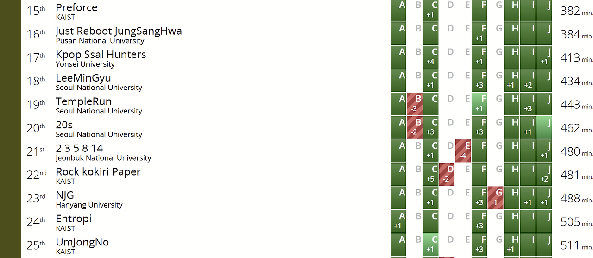

작년 Hey Jinhwi 팀의 버스기사 gs20036이 군대에 가서, 올해는 25학번 신입생 cywohoy를 납치해서 ICPC에 나갔다. 팀에 종이(cywohoy)와 돌(abra_stone)이 있었기에 대충 팀명은 Rock kokiri Paper로 정했다(k가 소문자인 건 실수다). 몇 번의 팀 연습을 한 뒤 정해진 전략은 다음과 같다:

1. 내가 초반에 스코어보드 따라서 플하위까지 빠르게 푼다.

2. cywohoy가 정수론, 미적분학, FFT 문제를 잡는다.

3. abra_stone이 DP, 그리디 문제를 잡는다.

4. 내가 자료구조, 기하, 문자열 문제를 잡는다.

나머지 팀원 2명이 현재 코드포스 블루고 나만 오렌지이기 때문에 쉬운 문제를 푸는 시간의 차이가 유의미하게 컸고, 컴퓨터를 번갈아가면서 잡는 것보다 내가 쉬운 문제를 하나 풀고 다음 걸 읽는 게 더 효율적이었다. cywohoy는 수학 고티어 문제를 많이 풀어 우리 중 유일하게 solved.ac 루비를 찍었기 때문에 처음 팀에 데리고 올 때부터 수학이 나오면 먹이기로 했었다. 내가 비교적 MZ PS러라 자료구조 비빔밥 같은 건 팀연습에서도 종종 풀었는데 DP와 그리디 같은 국밥은 플중위부터 잘 못 푸는 병이 있다. 그래서 무려 코드포스 기준 10년을 초과하는 노인 PS러인 abra_stone이 국밥을 밀기로 한 것이다. 플로우와 그래프는 딱히 담당을 정하진 않았다.

푼 문제는 다음과 같다:

A (00:08, +0 penalty) - Simple DP였다. 처음 잡은 문제부터 DP여서 살짝 알레르기가 올라왔지만 적당히 빠르게 AC.

F (00:15, +0 penalty) - 코드포스 Div.2 B 정도에 나올 것 같은 구현 문제였다. 구현이 살짝 헷갈렸지만 빠르게 AC.

H (00:46, +0 penalty) - 축을 45도 돌린 북서풍인 줄 알고 세그를 짰는데, 대회가 끝나고 생각해보니 LIS만 구하면 되는 문제였다고 한다. 그래도 적당히 빠르게 AC.

I (00:58, +0 penalty) - 한글 문제여서 처음에 나에게 넘어왔지만 KMO식 수학인 걸 보고 cywohoy에게 던져놨었다. 식을 조금 정리해보다가 코드를 짜더니 AC를 받았다.

J (01:01, +2 penalty) - 점에 가중치가 있는 그래프에서 최대 가중치의 $C_4$ subgraph를 찾는 문제였다. 간선이 25000개라 cywohoy가 식 정리를 하는 동안 혹시 $O(E^2)$이 되나 시도해봤는데, 페널티만 2개 쌓고 TLE. 갈아엎고 $O(VE)$ 풀이 짜서 AC를 받았다.

C (02:42, +5 penalty) - 수직선 위의 세 점을 장기의 포(包)처럼 움직여 원하는 위치로 옮기는 최소 횟수를 구하는 문제였다. 다른 팀들은 스코어보드 프리즈 전에도 상당히 많이 풀었던데, 나는 풀이가 전혀 안 보였다. 두 점의 위치를 적당히 바꿔보는 브루트포스 풀이를 짰지만 WA. 그러다 abra_stone이 유의미한 점이 몇 개 안 된다는 것을 관찰했고, 상태를 압축하는 BFS 풀이를 짰지만 또 WA를 받았다. 시간이 얼마 남지 않아 abra_stone이 갈아엎고 다시 짜기 시작했는데, 그때 내 코드의 오류를 찾아서 고치니까 AC가 나왔다. 다른 점을 정확히 1개 뛰어넘을 수 있는데 2개 뛰어넘는 것도 가능하게 짰었던 것이다.

결과는 22등으로 리저널에 진출했다. 우리보다 높은 등수의 KAIST 팀으로는 ibm2006의 즐겜 팀인 SMALLSHOT, parkky와 2명의 오렌지가 있는 GEESE CROSSING, 올해 KAIST 최고 전력인 3 레드 팀 Fox is cute, 그리고 외국인 팀 Preforce가 있었다. 초반 전략이 잘 먹혀서 5문제까지의 페널티가 219였는데, 남들처럼 C번을 2시간 이내에 적은 페널티로 풀었다면 교내 3등도 아슬아슬하게 노려볼 만 했다는 점이 좀 아쉽다. 리저널에서는 asdfasdf의 즐겜 팀인 Busan Tourism 팀도 매우 강할 예정이기 때문에 맥레 레드 이상을 보유한 4+@팀 사이에서 아챔을 가려면 J에다가 틀릴 것 같은 코드를 내거나 C 같은 문제에서 말리는 일 없이 플중위까지는 2시간 내에 밀 수 있어야 할 것 같다. 리저널까지의 연습 계획은 다음과 같다:

1. 내가 과거 한국 리저널의 플래티넘 문제를 최대한 푼다.

2. abra_stone이 과거 한국 리저널의 DP / 그리디 다이아 중하위 문제를 최대한 푼다.

3. cywohoy에게 (from:korea & (tag:number_theory | tag:calculus | tag:fft))를 먹인다.

4. eertree 사태를 대비해 고수들의 블로그나 소멤 블로그 등에서 아직 나온 적 없는 수상한 알고리즘과 자료구조를 최대한 뜯어와서 팀노트에 넣을 수 있게 걔량한다.
