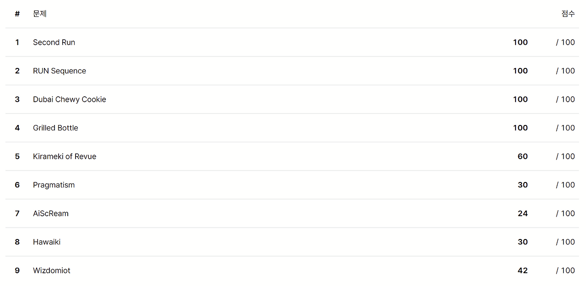
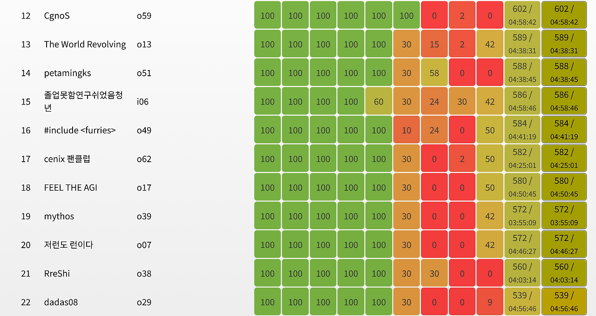

올해도 역시 런 봄 대회가 열렸고, **졸업못함연구쉬었음청년**이라는 핸들로 참가했다. 닉네임의 유래는 잘 모르겠지만, 작년에 KAIST의 누군가가 대학원에 합격해놓고 마지막 학기에 과제를 안 내고 놀다가 F를 받으면서 졸업을 못 했다는 것 같다. 참고로 내 2023~2025 ICPC 팀원이었던 abra_stone의 핸들은 **@오태인 졸업 축하해**였다.

우선 밑밥을 좀 깔고 시작하자. ICPC APAC 이후 PS는 할 일 priority queue에서 밀렸고 Pokémon Champions 출시 이후 PS는 취미 priority queue에서도 밀려 요즘 PS를 거의 안 했었다. 실제로 코포도 퍼플에 갔고 앳코더도 민트에 간 것으로 보아 폼이 최근 2년 중 최악인 것 같다고 느꼈다. 이전 같았으면 당연히 풀고 넘어갈 문제들에서 한 번씩 크게 막히는 느낌?

그래서 대회 전에 전략을 세우길, 풀이가 안 보이는 문제에 도달하면 모든 문제의 자명한 서브태스크를 풀고 다시 돌아오기로 했다. 보통 풀태스크를 고민하는 건 고점을 세우기 위해서인데 지금 내 상태로는 힘들다는 판단이었고, 결론부터 말하자면 해당 전략 덕분에 나름 선방할 수 있었다. 타임라인은 아래와 같다.

## 00:11:29

런 대회는 굳이 첫 문제에 자명한 브론즈 실버를 내지 않았던 것은 알고 있었지만, A를 처음 보고 쉽지 않은 것 같아 잠깐 당황했다. 하지만 A번 난이도일 것이라는 믿음을 갖고 생각하니 적당한 비둘기집 그리디 전략이 보여 AC를 받았다.

## 01:05:00

A에서 AC를 받고 B로 넘어갔지만, 풀이를 찾지 못했다. 대충 초항 2개를 $a$, $b$라고 하면 $a$와 $b$에 연속한 두 피보나치 수를 곱한 것의 합으로 표현이 된다는 10초 만에 관찰 가능한 사실을 제외하면 유의미한 관찰을 하지 못했고, 이상한 수식 정리를 잔뜩 하다가 C로 넘어갔다. 그러나 C도 풀이가 바로 보이지 않아 당황했고, 스코어보드에서 D가 많이 풀리는 것을 확인하고 D로 넘어갔다. 실제로 D는 문제를 읽자마자 풀이가 보이는 유형의 간단한 자료구조 문제였고, AC를 받았다. 이런 관상의 문제는 보통 처음에 set만으로 풀 수 있을 것 같다가 중간에 세그가 필요해져 화가 난다는 걸 귀납적으로 알았기에 일단 세그부터 짜고 구현을 시작했는데 짜다 보니 정말 set만 필요한 문제였다. 그래서 욕을 하면서 세그를 지웠다. 나는 set을 2개 썼는데 끝나고 abra_stone과 이야기하다 보니 2번째 set은 그냥 priority queue로 대체 가능하다는 것을 알았다.

## 01:30:56

B에는 꽤 많은 시간을 박았었기에 D에서 AC를 받고 C로 넘어왔다. 조금 생각을 해보니 $ax+b$, $ay+b$, $axy+b$꼴의 식이 정점마다 최대 한 개씩 곱해진 상태에서 한 개의 쿼리는 특정 항의 계수를 묻는 문제라는 것을 알 수 있었다. 처음에는 FFT 응용이 필요한 오버킬 풀이를 낸 건가 싶었지만 생각해보니 나이브한 다항식 곱셈으로 충분하다는 걸 알고 구현해서 AC를 받았다. 에디토리얼은 같은 풀이를 DP의 언어로 서술한 것 같던데, 내가 DP력이 딸려서 그렇게 사고하기는 어려웠던 것 같다.

## 02:09:55

C에서 AC를 받고 E로 넘어왔다. 대충 여러 수가 있을 떄 XOR을 오름차순으로 보는 것은 예전에 'XOR MST'라는 문제를 풀 때 한 적이 있기에 비슷하게 하면 된다고 생각했다. 수들을 앞 비트부터 보면서 XOR의 결과에서 맨 앞이 $0$인 것의 개수를 세고, 이를 통해 한 단계 아래로 분기를 내려오는 식으로. 그러나 왠지 풀이 구체화가 되지 않았고 서브태스크부터 긁기로 했다. 처음 제출에서는 25점밖에 받지 못했지만 사소한 버그를 고치고 다시 제출하니 60점을 받았다.

## 02:41:41

이제는 진짜로 B에서 점수를 받아야 한다고 생각했다. 그러나 아무리 생각해도 풀이가 떠오르지 않아 우선 서브태스크부터 긁었고 50점을 받았다.

## 02:53:35

열심히 식을 적으며 생각한 결과 드디어 닫힌 꼴의 답을 얻었다. 바로 구현해서 AC를 받았다. 이후 끝나고 에디토리얼을 공개할 때 매우 충격을 받았다. 내 풀이보다 훨씬 쉬운 풀이가 있었기 때문인데, 내 코드는 아래와 같다. 어쩐지 B를 풀고 나서 사람들이 이렇게 수학을 빠르게 푼다는 점에 놀랐는데 그냥 내가 혼자 삽질하고 있던 것이었다.

```cpp
#include<bits/stdc++.h>
using namespace std;
typedef long long ll;

ll r, u, n, arr[100005] = {1, 1};

int main(){
    scanf("%lld %lld %lld", &r, &u, &n);
    int k = 2;
    while(true){
        arr[k] = arr[k-1]+arr[k-2];
        if(arr[k]>1e9) break;
        k++;
    }
    if(n-2>=k) printf("%lld", r*u);
    else{
        ll x = arr[n-3], y = arr[n-2];
        ll p1 = r/y, q1 = r%y, p2 = u/x, q2 = u%x;
        printf("%lld", q1*q2*(p1+p2+1)+q1*(x-q2)*(p1+p2)+(y-q1)*q2*(p1+p2)+(y-q1)*(x-q2)*(p1+p2-1));
    }
}
```
(2026.05.18 update) oj.uz에 위 코드를 제출한 결과 심지어 강한 데이터에서 틀린다는 것을 알았다.

## 03:11:26

이 시점에 이미 대회를 말아먹었음을 직감했고, 모든 자명한 서브태스크를 긁기라도 해야겠다는 판단을 했다. 이런 대회의 경우 순위권 아래 등수는 어차피 모두 사실상 동등해지기 떄문에 사람들은 보통 고점을 바라보고 서브태스크를 열심히 긁지 않는다는 걸 알았기에 내린 판단이었다. 스코어보드를 보니 I에서 42점을 받은 사람들이 많길래 바로 I로 넘어갔다. 42점 서브태스크는 제한을 보니 세제곱이었고 조금 생각하니 세제곱 풀이는 매우 쉬워서 구현하고 AC를 받았다. 끝나고 azberjibiou는 조금만 더 생각해서 제곱을 짜고 75점을 받는 게 최적이라고 주장했지만 당시에는 스코어보드에 75점이 거의 없었기에 조금도 시간을 더 쓰지 않고 다음 문제로 넘어갔다.

## 03:55:59

H를 읽었다. 스코어보드에는 2점만 긁은 사람들이 대부분이었지만 그래프에 기하를 예쁘게 섞어 놓은 관상이 내 스타일이라고 생각해서 30점 서브태스크 정도는 생각을 해 보기로 했다. 서브태스크가 복잡하게 서술되어 있으면 보통 이 서브태스크만을 위한 쉬운 풀이가 있다는 뜻인데, 역시 쉬운 풀이가 있었다. 사실상 점들의 좌표는 입력을 받을 필요도 없는 세팅이었고 적당히 자연스럽게 해를 구성하면 되는 풀이를 짜서 AC를 받았다.

## 04:25:36

스코어보드를 통해 parkky가 G에서 AC를 받았다는 사실을 알 수 있었다. 그래서 어쩌면 나도 풀 수 있지 않을까 싶어서 문제를 읽다가 포기했다. 이미 정신적 리소스를 상당히 사용한 상태였고 문제 지문이 특히 길고 복잡해서 그냥 서브태스크만 긁기로 했다. 3번 서브태스크를 적용해 문제를 읽으면 훨씬 쉬워지는 것을 관찰하고 해당 경우의 풀이를 짜기 시작했다. 우선 내가 문제를 제대로 이해했는지 확인하기 위해 3번 서브태스크의 하위 서브태스크인 2번 서브태스크의 풀이를 짜서 9점을 긁었다.

## 04:43:10

2번 서브태스크가 맞았다는 사실을 통해 문제 이해를 올바르게 했다는 사실은 알 수 있었고, 3번 서브태스크까지 구현해서 총 24점을 긁었다. 1번 서브태스크까지 긁을까 고민했지만 아직 F번을 긁지 않았기에 넘어갔다.

## 04:48:27

마지막으로 F에 넘어왔다. 사실 중간중간 비는 시간에 F를 읽고 조금 고민을 해 보기는 했었는데, 문제 세팅만 보면 그냥 내 지도교수님이 줄 법한 문제라 혹시 풀 수 있지 않을까 싶었지만 유효한 관찰을 아예 못 했었다. 그래서 그냥 곱게 작은 서브태스크만 긁기로 했다. 일단 2번 서브태스크가 그냥 자명하길래 구현해서 10점을 긁었다.

## 04:58:46

1번 서브태스크는 그냥 나이브를 짜면 긁을 수 있었는데, 살짝 구현이 오래 걸려 끝나기 직전에야 긁는 데 성공했다. 저때 시간에 쫓겨 실행도 안 시켜보고 냈는데 다행히도 30점이 긁혔다. 대회 끝날 때 물리적으로 덜덜 떨고 있었던 게 기억이 난다.





결과는 586점으로 15등을 기록했다. 4솔 중에는 압도적인 등수를 기록했기에 E를 풀지 못하는 폼으로 할 수 있는 최고의 성적을 냈다고 생각한다. G에서 6점짜리 1번 서브태스크를 긁었다면 2등이 더 올라간다는 사실 정도가 아쉽다. 그러나 사실 정말 중요한 점은 D까지 푸는 데에 3시간을 썼다는 점과 E를 못 풀었다는 사실로, 작년에 경쟁자처럼 여겼던 johnny8337과 parkky가 모두 6솔을 했다는 점을 생각하면 매우 반성해야 할 결과를 받은 것 같다. 룸메인 azberjibiou가 매일같이 기숙사에서 말하듯 Pokémon Champion를 할 시간에 한 문제씩이라도 풀어 여름 전에 폼을 조금은 올려야 하지 않을까 싶다.

여담으로, 랜덤 특별상을 받는 데에 성공했다. 시드를 불러 달라고 할 때 운영진인 ibm2006이 APIO 2024에 출제한 Magic Show의 정해로부터 비롯된 우주상수인 4991을 외쳤는데 마법같이 내가 추첨에 걸려버린 것이다. 내가 RUN 운영진들과 사적으로 친하고 4991이 well known은 아니라서 조작을 의심당할까 두려웠다.

아무튼 이번에도 성공적으로 대회를 진행해준 RUN 운영진들에게 고맙다고 전하고 싶다. 나는 딱 1년만 운영하고 문제도 슬롯 채우기용 골드 한 문제를 출제한 게 다인데 세 학기 째 양질의 문제를 공급하는 ibm2006 같은 친구들은 어떻게 하는 것인가 경외감이 든다.
