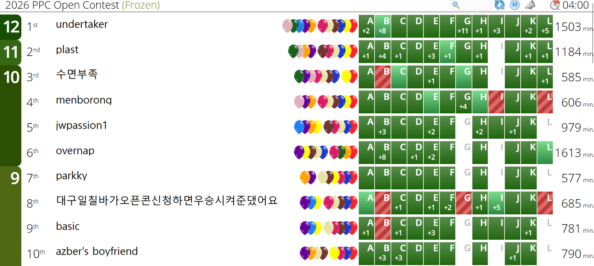

2026 POSTECH Programming Contest의 오픈 컨테스트인 2026 PPC Open Contest에 **azber's boyfriend**라는 닉네임으로 참가했다. 상품이 10등까지 주어진다고 하여 10등 안에 들기만을 목표로 시작했다.

## 타임라인

### 00:02:10

A를 읽었고 브론즈~실버 정도의 쉬운 문제이길래 바로 구현해서 AC를 받았다.

### 00:33:52

A에서 AC를 받은 후 바로 B로 넘어갔다. $P$와 $C$로만 이루어진 문자열이 주어졌을 때 적절히 cycle shift를 하고 문자를 제거해 $CPP$를 substring으로 갖게 만들 때의 최대 길이를 구하는 문제였다. 대충 플래티넘 하위쯤 되는 풀이가 보여서 구체화를 하다가, ICPC 셋에서 플래티넘 문제를 초반에 잡는 것이 나쁜 전략이라는 것을 조금 늦게 깨닫고 스코어보드를 봤다. 많이 풀린 E를 읽었더니 역시 아주 쉬운 문제이길래 바로 구현해서 AC를 받았다.

### 00:38:01

E에서 AC를 받고 스코어보드를 따라 K로 넘어왔다. 간단한 아이디어에 구현이 매우 짧은 문제라 빠르게 AC를 받았다. 무심코 놓칠 $n=m=1$ 엣지 케이스가 있는 문제였지만 예제에 주어져 있다는 점이 매우 친절하다고 느꼈다.

### 00:58:59

다시 스코어보드를 따라 C로 넘어갔다. 수열을 복원하는 인터랙티브 문제였고, 역시 어렵지 않은 풀이가 바로 보여 48분에 첫 제출을 했지만 첫 테스트케이스에서 RTE를 받았다. 익숙하지 않은 플랫폼 + 인터랙티브 + 런타임 에러 조합은 도저히 어디서 틀렸는지 짐작을 할 수 없는 조합이라 조금 멘탈이 나갔다. 풀이는 틀릴 구석이 없다고 생각했기에 flush 전에 개행이 필수인지 등을 체크하고 `scanf`, `printf`를 `cin`, `cout`으로 고쳐보는 등 여러 수정을 했지만 결과가 바뀌지 않은 채로 3WA를 적립했다.

### 01:06:02

스코어보드에서 여러 문제가 빠르게 풀리고 있었기에 C를 버리고 D로 넘어왔다. 지문이 길게 적혀 있었지만 해석하면 역시 아주 쉬운 문제였다. 구현해서 AC를 받았다.

### 01:10:48

스코어보드를 따라 H로 넘어갔다. 격자 위의 해 구성 문제는 보통 홀짝성 등을 고려해서 케이스를 나눠야 하는 경우가 많은데 그것마저 필요가 없는 해 구성 문제였다. 바로 구현해서 AC를 받았다.

### 01:17:59

스코어보드를 보니 대충 7솔까지가 매우 쉬운 문제 같았고, C를 제외하면 남은 문제가 J길래 빠르게 J로 넘어갔다. 코드포스 Div.2 앞 부분에 나올 법한 문제였고 구현해서 AC를 받았다. 수가 $200000$까지 주어지는데 실수로 $20000$이라고 쳐서 1WA를 받았지만 22초만에 빠르게 고쳐 59초에 AC를 받는 데 성공했다.

### 01:24:12

이제 정말로 C에서 AC를 받지 않고 넘어가면 안 될 것 같아 다시 C를 봤는데, 내 풀이가 $n=1$에서 올바르게 동작하지 않는다는 것을 깨달았다. 고쳤더니 AC가 나왔다.

### 02:04:25

이제 스코어보드에서 빠르게 많이 풀린 문제가 없는 것 같아 아까 풀이가 거의 나온 B로 넘어갔다. 구현에 시간이 조금 걸려 1시간 39분에 첫 제출을 했지만 WA를 받았다. 풀이의 cyclic 최대 구간합을 그냥 최대 구간합으로 계산했다는 것을 알고 다시 구현했지만 2WA를 더 받고 말았다.

### 02:14:24

그러다가 스코어보드에서 F가 상당히 많이 풀린다는 것을 보았고, 읽어 보니 그냥 누적 합 배열에서 가장 많이 등장하는 것의 개수를 구하면 되는 문제로 바로 환원이 되었다. 바로 구현해서 AC를 받았다. 아무래도 그저 스코어보드에서 사람들이 풀지 않아서 다들 늦게 푼 문제 같았다.

### 02:22:35

다시 B로 넘어갔지만 도저히 반례를 찾을 수 없었다. 그래서 그냥 코드를 계속 뚫어져라 보다가, 문제를 찾아냈다. 처음에 문자열을 받고 맨 앞에 $C$를 위치하게 하고 싶어서 받은 문자열을 cyclic shift하는데, 이 과정에서 $2N$ 정도의 공간이 필요했던 것이다. 이를 수정하여 제출했더니 AC를 받았다.

풀이는 대충 각 $C$ 바로 뒤에 있는 $P$의 개수를 저장한 배열 $a$를 잡고, cyclic하게 연속한 두 구간으로 나누어 한 쪽은 $C$를 전부 제거하고 한 쪽은 각 $C$ 뒤에 $P$를 최대 한 개까지만 남긴다는 construction을 $a$의 관점에서 정리하면 나온다. $a_l$부터 $a_r$까지에 대해 $P$를 최대 한 개까지 남긴다면 제거하는 문자의 개수는 $\sum \limits _{i=l} ^r \max(0, a_i-1) + |a|-(r-l+1) = |a| + \sum \limits _{i=l} ^r (\max(0, a_i-1)-1)$이 되므로 $b_i = -\max(0, a_i-1)+1$로 정의한 배열의 최대 구간합을 구하는 문제로 환원된다. 몇 가지 디테일이 더 필요하긴 하지만 생략한다.

### 04:00:00

결론부터 말하자면, 이후 어떤 제출도 하지 못했다. G, I, L이 남은 시점에서 각 문제를 읽어보니 G는 xor + constructive, I는 기하, L은 그래프 순회라는 인상이 남았고 기하가 재미있을 것 같아 I를 잡았다. 대충 구간 속 점들의 convex hull에 접선을 그어 기울기를 확인하는 문제였는데 정해의 핵심인 "구간을 여러 개로 쪼개어 각각의 convex hull에 대해 풀어도 약해지지 않는다"를 떠올리지 못해 1시간을 잡고 폭사했다. 시간이 10분쯤 남았을 때 스코어보드의 상위권이 전부 G를 풀었길래 조금 고민해보니 비트를 6개씩 쪼갠 다음 각 부분에 대해 64개의 가능한 케이스를 전부 만들어 두고, 이를 조합해 뒤쪽 수를 전부 construct하면 앞 400개 정도만 남는다는 것을 알 수 있었다. 이들에 대해서는 또 앞 31개의 수를 각 비트만 켜진 수로 만들고 나머지를 construct할 수 있고 남은 31개도 적절히 만들어주면 된다는 정도의 풀이를 알 수 있었다. 그러나 이를 구현할 시간은 되지 않아 아쉽게 대회를 마무리하게 되었다.

## 총평

이렇게 딱 10등으로 대회를 마무리했다. 초반에 1문제를 풀고 B에 박거나, C에서 $n=1$ 테스트케이스를 고려 못하고 WA를 쌓거나, 배열 범위 때문에 B에서 패널티를 또 쌓는 등 실제 ICPC였다면 멘탈이 상당히 나갔을 상황이 이어졌음에도 처음 목표였던 등수를 달성할 수 있었던 것은 기쁜 일이다.

그러나 풀 법 했던 I에 1시간을 넘게 박고도 풀이를 못 냈다는 점, I가 안 풀릴 때 G로 넘어갔으면 한 문제를 더 풀 수 있었을 것 같다는 점 등 중요한 대회가 아니라는 생각에 안일하게 임함으로써 나온 후반부 이슈는 아쉽긴 하다. 대회가 끝나고 사람들의 이야기를 들어보니 L도 플하위 이하의 쉬운 문제라는데, 다익스트라 등 그래프 탐색 문제만 나오면 abra_stone한테 던지던 습관을 이제는 고쳐야 할 것 같다.
