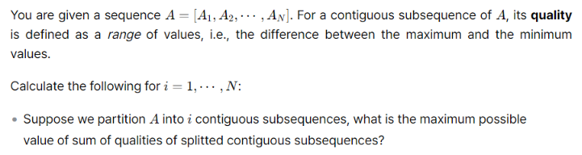
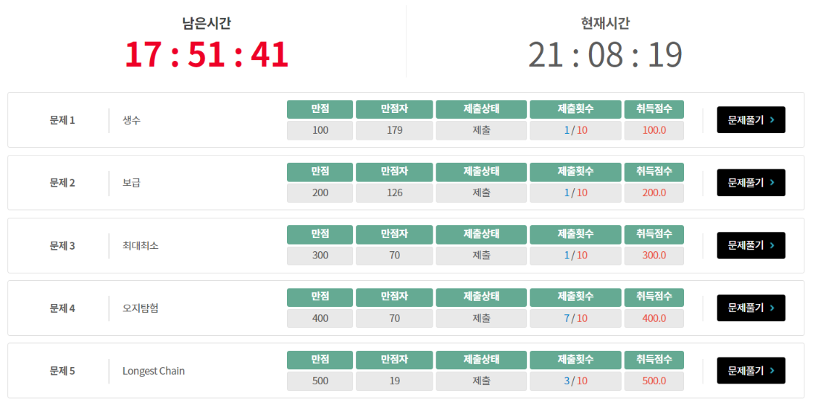

아직 1차 예선이라 후기보다는 풀이 위주로 작성한다.

## 생수

매일 아침에 생수 하나를 먹는 사람이 $N$병의 생수를 가지고 있다. $M$의 배수 날짜마다 생수가 1병 배달될 때, 생수를 마시지 못하는 첫 번째 날짜를 구하는 문제이다.

대충 달팽이가 매일 올라가고 내려가는 문제와 유사하다는 느낌을 받았다. $N$과 $M$의 범위가 $10^{12}$으로 매우 크기 때문에 수식을 정리할 필요가 있을 것 같지만, 케이스워크가 될 것 같아 $O(\log_{M}{N})$ 정도의 풀이로 해결하였다.

우선 처음 $N$일간은 확정적으로 생수를 마실 수 있기에, 그 다음 생겨난 생수의 양을 생각해보면 $\lfloor N/M \rfloor$이다. 이제 그 생수를 다 마시고 난 후에 생겨 있는 생수의 양을 계산하길 반복하면 $\log_{M}{N}$ 정도의 반복으로 끝나게 된다. 코드는 아래와 같다.

```c++
#include<bits/stdc++.h>
using namespace std;
typedef long long ll;

int t;
ll n, m;

int main(){
    scanf("%d", &t);
    for(int _=1;_<=t;_++){
        scanf("%lld %lld", &n, &m);
        printf("Case #%d\n", _);
        ll k = 0;
        while(true){
            ll x = n/m-k/m;
            k = n;
            n += x;
            if(x==0) break;
        }
        printf("%lld\n", n+1);
    }
}
```

## 보급

수직선 위에 창고 $N$개가 주어진다. 이때 어떤 점의 **위험도**는 3번째로 가까운 창고까지와의 거리이다. 양쪽 끝 창고 밖으로는 나갈 수 없다고 할 때, 가능한 위험도의 최댓값과 최솟값을 구하는 문제이다.

왼쪽 끝에서 오른쪽 끝으로 쭉 이동한다고 생각해보자. 현재 나와 가까운 3개의 창고가 왼쪽부터 $A, B, C$라고 하면, 언젠가 $A$가 빠지고 오른쪽에 새로운 창고 $D$가 들어오게 된다. 그리고 이 시점은 $A$와 $D$의 중점에서 일어난다.

따라서 3칸 떨어진 창고들 간의 중점마다 보고 있는 창고의 후보를 업데이트하며 적당히 계산을 해주면 된다. 코드는 아래와 같다.

```c++
#include<bits/stdc++.h>
using namespace std;

int t, n, arr[200005];

int calc1(int a, int b, int c, int l, int r){
    int m = (a+c)>>1;
    if(l<=m&&m<=r) return c-m;
    if(m>r) return c-m;
    return m-a;
}

int calc2(int a, int b, int c, int l, int r){
    return max({abs(c-l), abs(c-r), abs(a-l), abs(a-r)});
}

int main(){
    scanf("%d", &t);
    for(int _=1;_<=t;_++){
        scanf("%d", &n);
        for(int i=0;i<n;i++) scanf("%d", &arr[i]);
        printf("Case #%d\n", _);
        sort(arr, arr+n);
        int a = arr[0], b = arr[1], c = arr[2], mn = 1e9, mx = -1, prv = arr[0];
        for(int i=3;i<n;i++){
            int x = (a+arr[i])/2;
            mn = min(mn, calc1(a, b, c, prv, x));
            mx = max(mx, calc2(a, b, c, prv, x));
            a = b, b = c, c = arr[i];
            prv = x;
        }
        mn = min(mn, calc1(a, b, c, prv, arr[n-1]));
        mx = max(mx, calc2(a, b, c, prv, arr[n-1]));
        printf("%d %d\n", mx, mn);
    }
}
```

## 최대최소

수열이 주어지면 이를 연속한 구간들로 쪼개어, 각 구간의 최댓값과 최솟값의 차이를 모든 구간에 대해 더한 값을 최대화하는 문제다.

문제에 대한 관찰을 하기 전에, 2024년 KAIST 문제해결기법 과제였던 아래 문제를 살펴보자.



그렇다. 나는 이 문제의 상위 버전을 본 적이 있었고, 그냥 당시에 배운 풀이를 그대로 짜서 냈다.

풀이는 상당히 아름다운데, 문제를 한 단계 일반화해보자. 굳이 구간을 쪼개고 구간별 최댓값과 최솟값을 찾지 말고, 그냥 수열의 각 수에 $+1, 0, -1$을 곱해 더하는 문제로 보는 것이다. 자세히 말하면 아래와 같다.

1. 앞에서부터 볼 때 $+1$이 등장한 횟수와 $-1$이 등장한 횟수는 최대 1회 차이가 난다.
2. $+1$이 나오는 총 횟수와 $-1$이 나오는 총 횟수는 같다.

위 조건을 만족하게 $+1, 0, -1$을 곱해 더한 값의 최댓값은 원 문제의 답과 같음을 쉽게 확인할 수 있다. 환원된 문제는 쉬운 DP로 해결 가능하며 코드는 아래와 같다.

```c++
#include<bits/stdc++.h>
using namespace std;
typedef long long ll;

int t, n;
ll arr[200005], dp[200005][5];

int main(){
    scanf("%d", &t);
    for(int _=1;_<=t;_++){
        scanf("%d", &n);
        for(int i=1;i<=n;i++) scanf("%lld", &arr[i]);
        printf("Case #%d\n", _);
        for(int i=0;i<=n;i++){
            for(int j=0;j<3;j++) dp[i][j] = -1e18;
        }
        dp[0][0] = 0;
        for(int i=1;i<=n;i++){
            dp[i][0] = max({dp[i-1][0], dp[i-1][1]-arr[i], dp[i-1][2]+arr[i]});
            dp[i][1] = max(dp[i-1][0]+arr[i], dp[i-1][1]);
            dp[i][2] = max(dp[i-1][0]-arr[i], dp[i-1][2]);
        }
        printf("%lld\n", dp[n][0]);
    }
}
```

## 오지탐험

간선에 길이가 부여된 그래프가 주어지고 시작점과 도착점 사이의 최단 경로를 구하는 일반적인 다익스트라 문제다. 유일한 차이점은 간선에 시각 가중치가 부여되어 있어 이 값이 감소하지 않는 순서로만 이동할 수 있다.

결국 각 정점 입장에서 유효한 시각은 자신에게 incident한 간선에게 부여된 시각 뿐이다. 따라서 그냥 정점 $v$를 $\deg(v)$개의 정점으로 쪼개어 생각하면 된다. 제자리에서 시간을 보내는 것을 길이 0의 단방향 간선으로 생각하고 시각 가중치가 $t$인 $(u, v)$ 간선은 $u$와 $v$를 쪼갠 정점들 중 시각 $t$를 나타내는 정점을 서로 연결하여 표현하면 시각 가중치에 관한 조건이 없어진 그래프를 얻는다. 원본 그래프의 정점 개수를 $N$, 간선 개수를 $M$개라고 하면 새 그래프는 정점과 간선이 모두 $O(M)$개인 그래프가 되어 다익스트라를 돌리면 $O(M\log M)$의 시간에 문제를 해결할 수 있다.

처음에는 그래프를 명시적으로 새로 만들지 않는 구현을 시도하다가 여러 번 틀리고, 제출 횟수가 얼마 남지 않아 아예 갈아엎고 새로 구현을 했다. 그런데 TLE가 떠서 `map` 대신 `vector` 위의 `lower_bound()`를 사용한 결과 겨우 AC를 받을 수 있었다.

```c++
#pragma GCC optimize("O3")
#pragma GCC optimize("ofast")
#pragma GCC optimize("unroll-loops")
#include<bits/stdc++.h>
using namespace std;
typedef long long ll;
typedef pair<ll, ll> pi;

int t, n, m, s, e;
pi arr[200005];
ll brr[200005], crr[200005], drr[400005];
vector<pi> adj[400005], vec;
vector<ll> inc[200005];

int calc(pi x){return lower_bound(vec.begin(), vec.end(), x)-vec.begin();}

int main(){
    scanf("%d", &t);
    for(int _=1;_<=t;_++){
        scanf("%d %d", &n, &m);
        for(int i=0;i<m;i++) scanf("%lld %lld", &arr[i].first, &arr[i].second);
        for(int i=0;i<m;i++) scanf("%lld %lld", &brr[i], &crr[i]);
        scanf("%d %d", &s, &e);
        printf("Case #%d\n", _);
        for(int i=1;i<=n;i++) inc[i].clear();
        for(int i=0;i<m;i++){
            auto [u, v] = arr[i];
            inc[u].push_back(crr[i]);
            inc[v].push_back(crr[i]);
        }
        inc[s].push_back(0);
        vec.clear();
        for(int i=1;i<=n;i++){
            sort(inc[i].begin(), inc[i].end());
            inc[i].erase(unique(inc[i].begin(), inc[i].end()), inc[i].end());
            for(auto j: inc[i]) vec.push_back({i, j});
        }
        for(int i=0;i<vec.size();i++) adj[i].clear();
        for(int i=1;i<=n;i++){
            for(int j=1;j<inc[i].size();j++){
                int u = calc({i, inc[i][j-1]}), v = calc({i, inc[i][j]});
                adj[u].push_back({v, 0});
            }
        }
        for(int i=0;i<m;i++){
            auto [u, v] = arr[i];
            int a = calc({u, crr[i]}), b = calc({v, crr[i]});
            adj[a].push_back({b, brr[i]});
            adj[b].push_back({a, brr[i]});
        }
        for(int i=0;i<vec.size();i++) drr[i] = 1e18;
        priority_queue<pi> pq;
        pq.push({0, calc({s, 0})});
        while(!pq.empty()){
            auto [d, u]= pq.top();
            pq.pop();
            if(drr[u]!=1e18) continue;
            drr[u] = -d;
            for(auto [v, a]: adj[u]){
                if(drr[v]!=1e18) continue;
                pq.push({d-a, v});
            }
        }
        ll res = 1e18;
        for(auto i: inc[e]) res = min(res, drr[calc({e, i})]);
        if(res==1e18) printf("-1\n");
        else printf("%lld\n", res);
        fflush(stdout);
    }
}
```

## Longest Chain

직선 $N$개가 주어지면 여기서 만들 수 있는 아래로 볼록한 껍질 중, 가장 자주 꺾인 것을 찾는 문제이다.

5번 치고는 쉽다고 느낀 문제로, $N$이 $2000$이라 그냥 모든 교점을 $x$좌표 순으로 정렬하고 차례대로 볼 수 있다. 각 직선에 대해 현 시점에 해당 직선이 마지막으로 쓰인 볼록 껍질의 꺾인 횟수 최댓값을 DP로 관리하자. 직선 $a$가 $b$ 위로 교차하는 교점을 본다고 할 때, 그냥 `DP[a]`에 `DP[b]+1`를 `max`로 넣어주면 된다.

처음 구현한 코드가 좌표 범위가 작은 서브태스크까지만 점수를 받길래 `double`을 `fraction`으로 바꿔 제출했더니 AC를 받았다. 코드는 아래와 같다.

```c++
#include<bits/stdc++.h>
using namespace std;
typedef long long ll;
struct frac{
    __int128 p, q;
    frac(){}
    frac(__int128 p, __int128 q): p(p), q(q){}
    void norm(){
        if(q<0) p *= -1, q *= -1;
    }
    bool operator<(const frac &other)const{return p*other.q<q*other.p;}
};
typedef tuple<frac, int, int> pi;
struct line{
    ll a, b, c;
    line(){}
    line(ll a, ll b, ll c): a(a), b(b), c(c){}
};

int t, n, brr[2005];
line arr[2005];

bool par(line u, line v){return u.a*v.b==u.b*v.a;}
frac com(line u, line v){return frac(v.c*u.b-u.c*v.b, u.a*v.b-v.a*u.b);}

int main(){
    scanf("%d", &t);
    for(int _=1;_<=t;_++){
        scanf("%d", &n);
        for(int i=0;i<n;i++) scanf("%lld %lld %lld", &arr[i].a, &arr[i].b, &arr[i].c);
        printf("Case #%d\n", _);
        for(int i=0;i<n;i++){
            if(arr[i].b<0) arr[i].a *= -1, arr[i].b *= -1, arr[i].c *= -1;
            brr[i] = 1;
        }
        vector<pi> vec;
        for(int i=0;i<n;i++){
            for(int j=i+1;j<n;j++){
                if(par(arr[i], arr[j])) continue;
                frac x = com(arr[i], arr[j]);
                x.norm();
                if(-arr[i].a*arr[j].b<-arr[i].b*arr[j].a) vec.push_back({x, i, j});
                else vec.push_back({x, j, i});
            }
        }
        sort(vec.begin(), vec.end());
        for(auto [u, v, w]: vec) brr[w] = max(brr[w], brr[v]+1);
        int res = 0;
        for(int i=0;i<n;i++) res = max(res, brr[i]);
        printf("%d\n", res);
        fflush(stdout);
    }
}
```

## 후기



4번까지 풀고 중간에 다른 일을 하다 와서 올솔까지의 시간이 좀 걸렸지만, 무난하게 푼 것 같다. 3번은 처음 보는 문제였으면 가장 헤맸을 것 같고, 5번은 지난 여름에 기하를 많이 풀어둬서인지 2, 3, 4보다도 쉽게 느껴졌다. SCPC 예선은 제출 기회 제한이 큰 변수라, 4번처럼 대충 해보려다가 제출 기회를 많이 날리는 일은 2차 예선에서는 주의해야 할 것 같다.

대회 형식상 LLM을 이용한 부정행위를 잡기 매우 힘들어 보이는데, 관련 대응은 어떻게 이루어질지도 궁금하다. 매년 2차 예선을 겨우 통과했던 기억이 있어 부정행위자를 잘 잡아줬으면 좋겠다는 바람이다.
