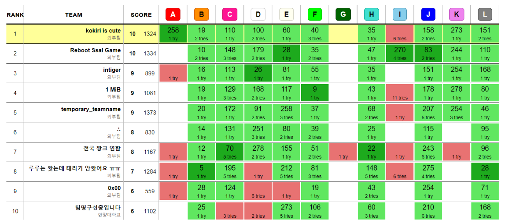

2026 숭고한 연합 알고리즘 경진대회에 다녀왔다. Kokiri is cute 팀은 지난 APAC가 끝나고 결성되었지만 아직 오프라인 대회에 참가한 적이 없었기에, 나름 데뷔전이라고 할 수 있는 대회였다.

지금까지는 내가 팀을 이끄는 포지션이었다면 이 팀은 너무 강력한 팀원 2명이 있어 팀 연습을 할 때도 느낌이 달랐다. `azberjibiou`는 2026년에 ICPC에 나가는 한국인 중에 가장 열심히 PS를 하는 사람 중 한 명이다. 관찰과 애드혹 문제를 정말 잘 푸는데, 복잡한 구현 문제도 잘 밀어낸다. `onjo0127`은 IOI & WF 출전자답게 나는 모르겠지만 잘 비비면 풀릴 것 같은 문제를 던지면 보통 풀어낸다. 그래서 내 역할은 초반에 쉬운 문제를 함께 밀고, 문제들에 대해 관찰을 어느 정도 해놓은 다음 기하 문제를 푸는 정도로 굳어졌다.

## 대회 시작 전 (~0:00)

등록을 하고 다과를 열심히 먹었다. 옆자리에 가장 견제되는 Reboot Ssal Game이 있길래 인사를 나누고 카이스트 ICPC 팀인 1MiB, 그냥 놀러 온 `flappybird`와 `johnny8337` 2인 팀과도 시간을 보냈다. 나름 전체 1등을 노리고 왔는데, 삐끗하면 카이스트 1등도 못 할 것 같아서 두려웠다. 머리를 자른 `jhnah917`님 등 검수, 출제진 중 아는 사람도 몇 보였다.

## 타임라인

### 0:19

B, F에서 WA를 한 번씩 받고 B AC. 나는 L이나 I 등 다른 문제들을 보고 있었다.

### 0:35

F, I에서 WA를 한 번씩 받고 H AC. I는 내가 문제를 잘못 읽어서 인접한 3개씩만 보면 되는 문제인 줄 알고 제출했으나 팀원이 정정해줘서 어려운 문제임을 깨닫고 내려놓았다.

### 0:40

F를 수정해서 AC. 이때까지는 스코어보드를 따라 풀고 있었고 나는 보지 않은 문제들이라 잘 기억이 나지 않는다. WA 패널티와 솔브 시간이 모두 밀려 스코어보드에서 상당히 아래에 위치했던 것으로 기억한다.

### 1:00

Reboot Ssal Game이 E를 푼 것을 보고 `azberjibiou`가 E를 잡았다. 2025 APAC 문제에 비슷한 것이 있다며 이렇게 빨리 풀릴 만큼 쉬운 문제가 아니라고 주장했는데, 다행히 한 번에 AC.

### 1:40

L이 많이 풀리는 것을 보고 내가 L을 잡았는데, 도저히 풀이가 떠오르지 않았다. 일단 $i$와 $i+n/2$를 파란 간선으로 모두 연결하고 생각해도 되고, 남은 간선들은 $1 \le i < n/2$에 대해 $i$와 $i$의 배수를 잇는 것으로 생각해도 됨은 증명했으나 이를 어떻게 구성할지 모르겠었고 그냥 증명 없는 적당한 풀이를 제출했으나 WA. 나중에 알게 된 사실이지만 이 풀이를 살짝만 바꾸면 많은 사람들의 AC 풀이가 된다고 한다. 이후 `onjo0127`이 D를 슥삭 밀면서 1WA 후 AC.

### 1:50

나는 L을 던진 다음 C를 봤는데, 뭔가 분명히 웰노운일 것 같은 문제였다. 고민하기보다 `azberjibiou`한테 던졌더니 무슨 다른 문제 이름을 말하면서 구현 구체화를 시작했다. 그리고 AC.

### 2:31

J가 좀 풀리는 걸 보고 쉬운 기하 문제인가 보다 하고 잡았는데 NP-hard인 longest path 문제를 특정 graph class에서 푸는 문제였다. 대체 어떤 기하적 성질이 있길래 그런가 했는데 `azberjibiou`가 내가 읽지 못한 조건을 찾아주었다. 바로 아주 쉬운 DP 문제가 돼서 구현했지만 WA. 다시 넣어보니 예제도 나오지 않았었다. 대충 예외 처리를 더 잘해줘야 하는 것 같아 잠깐 손을 놓은 사이 `azberjibiou`가 L의 증명 가능한 구성 풀이를 만들어서 AC. 이후 `azberjibiou`는 스코어보드 공개가 끝날 때까지도 다이아급 구성 문제가 이렇게 많이 풀리는 것에 대한 의문을 제기했다.

### 2:38

J의 구현을 끝내고 제출했더니 AC.

### 4:18

이후 `onjo0127`과 `azberjibiou`는 각각 I와 A를 풀었다며 구현을 시작했다. 둘 다 구현이 꽤 되는 문제라 시간이 걸렸고, I 제출은 WA를 받았지만 `azberjibiou`의 A 제출은 바로 AC.

### 4:33

`onjo0127`과 `azberjibiou`가 열심히 구현을 하는 동안 나는 할 일이 없어서 K를 읽어봤는데, 그냥 CHT 기본 문제라는 것을 알 수 있었다. 나는 구현을 하지 못할 것 같아 `azberjibiou`나 `onjo0127`의 구현 큐가 비면 넣으려고 했는데 생각보다 오래 걸리길래 팀노트의 `LineContainer`를 보고 직접 구현할 계획을 정리했다. 막상 해보니 쉽게 짤 수 있을 것 같았고, I에서 풀이가 조금 수정되는 것 같아서 내가 그 틈에 구현을 끝내고 AC.

### 4:59

`onjo0127`이 I의 구현을 끝내고 제출했지만 TLE. 100000 제한에 루트로그면 3초에 돌 법도 한데, 끝나고 들어보니 로그가 안 붙는 정해가 있어서 의도적으로 TL을 그렇게 설정했다고 한다. 이후 여러 시도를 했지만 AC는 받지 못했다.

## 대회 종료 후 (5:00~)

스코어보드 프리즈 전에 8솔브 팀이 꽤 많았고, 우리는 A를 맞았다는 이점이 있었지만 I와 K를 모두 푼 팀이 분명 존재할 것이라 생각해 상당히 긴장되었다. 특히 Reboot Ssal Game이 I를 맞은 눈치였고, K를 못 풀었을 리가 없다 생각했으며 프리즈 전에 30분 정도의 패널티가 앞서고 있었기에 우승은 힘들 것 같았다.

그러나 스코어보드를 확인하니 패널티 10 차이로 극적인 우승을 할 수 있었다! J랑 K밖에 짜지 않았지만 둘 다 조금이라도 느리게 짰거나 J에서 WA를 하나라도 더 쌓았거나 했다면 2등을 했을 것이기에 1인분은 겨우 했다 싶었다.

## 후기

아마 PS를 시작하고 처음으로 대회에서 우승을 해보는 것 같다. `azberjibiou`와 `onjo0127`이 열심히 버스를 운전해줘서 그런 것 같긴 하지만, 나도 최소한 버스를 뒤로 당기지 않게 노력해야겠다는 생각이 들었다. 팀노트에 있는 것들을 싹 한 번 사용해보고 손에 딱 붙는 기하 라이브러리를 정리해서 더러운 일을 도맡아 하는 포지션 정도라도 제대로 수행할 생각이다.

서울대학교에서는 2025 서울 리저널 한 자리 등수의 팀들이 올해도 꽤 출전하고, `imeimi2000`을 `lighton`으로 교체한 초강력 팀 floorsum이 있다고 알고 있다. 오늘 셋에 floorsum이 왔다면 I와 G 모두 어렵지 않게 풀고 12솔을 했을 것 같기에, 더 연습할 필요가 느껴졌다.

그러나 우승은 정말로 기분이 좋다! 남은 대회들도 좋은 결과들을 내고 싶다.
