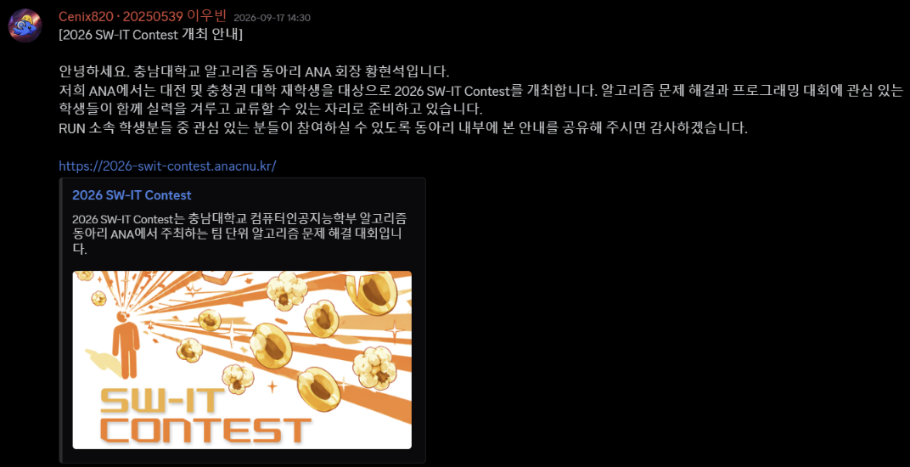
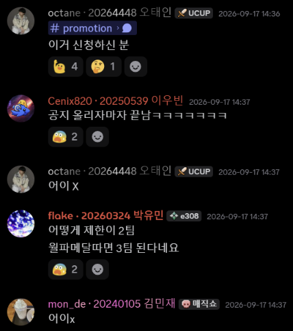
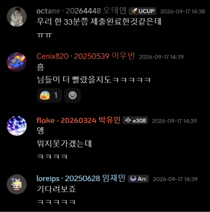
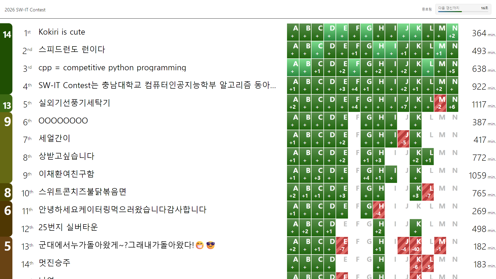
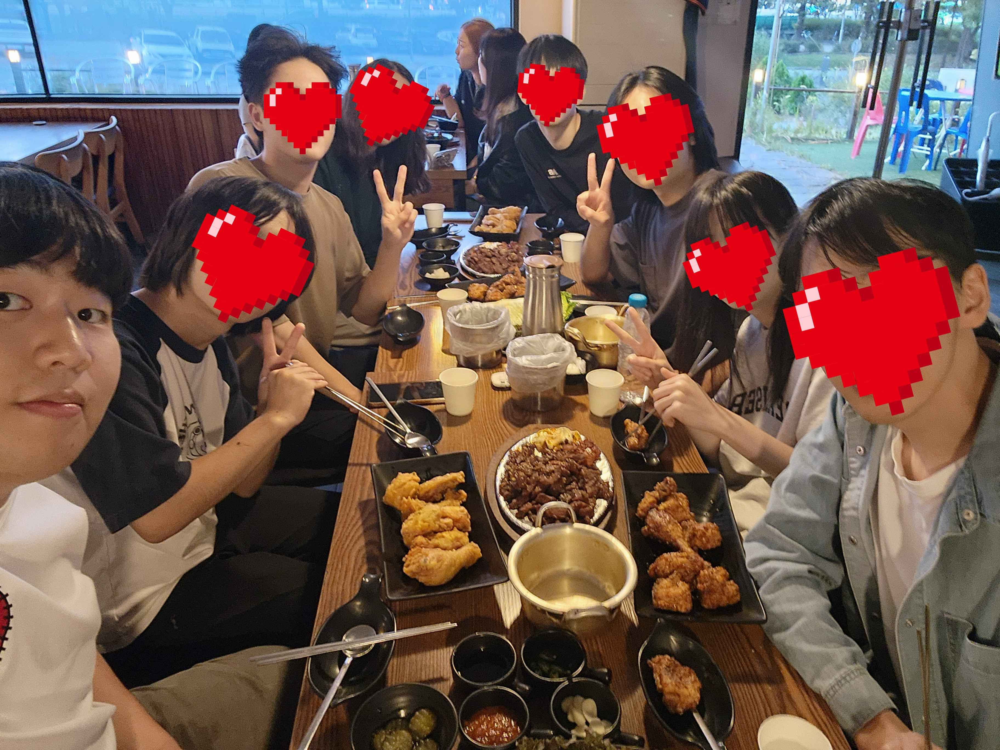

얼마 전 RUN 디스코드에 위와 같은 홍보 글이 올라왔다.

외부 팀은 학교당 6명까지만 받는다기에, 요즘 팀 연습 악귀가 되어 있는 3팀이 아주 빠르게 신청했고 1 MiB 팀이 떨어졌다.

나는 작년에 SW-IT Contest 검수를 하고 대회 당일에도 방문한 경험이 있다. 문제도 괜찮았던 것 같고, 케이터링도 잘 나왔던 것 같아 기대를 안고 대회장으로 출발했다.

대회 시작 전에는 KAIST에서 함께 온 LCAaww(이번 대회에서는 스피드런도 런이다) 팀과 놀았고, `yyyy7089`님이 보이길래 그쪽에서도 인사를 했다. 연세대 팀도 하나 있었던 것 같아, 1등을 노리고 왔는데 생각보다는 쉽지 않겠다 싶었다.

사실 가장 큰 문제는 노트북이 켜지지 않는다는 점이었다. 고등학교 1학년 때 한 번 겪은 것 같은 일로, Windows 업데이트 중에 뭔가 문제가 생겨서 무한 재부팅을 하고 있었다. 그때는 서비스센터에 다녀왔지만 이제는 GPT와 함께 Windows 최신 업데이트를 지워 버리고 문제를 해결하는 데 성공했다!

대충 내가 앞에서부터, 아즈버가 중간부터, 온조님이 뒤쪽부터 풀기로 하고 대회를 시작했다. 제출 타임라인은 아래와 같다. 3컴 대회였기에 제출 간격이 이상할 수 있다.

| 경과 시간 (시:분:초) | 문제 | 결과 |
| --- | --- | --- |
| 0:02:19 | [A. 스위트팝콘](https://aoj.anacnu.kr/contests/19/problems/A) | AC |
| 0:04:14 | [G. 스위트콘 찾기](https://aoj.anacnu.kr/contests/19/problems/G) | AC |
| 0:04:25 | [K. 해저 탐사](https://aoj.anacnu.kr/contests/19/problems/K) | AC |
| 0:07:20 | [H. 중심격자점](https://aoj.anacnu.kr/contests/19/problems/H) | AC |
| 0:08:22 | [B. 색각 보정](https://aoj.anacnu.kr/contests/19/problems/B) | AC |
| 0:11:05 | [C. 조각난 사진](https://aoj.anacnu.kr/contests/19/problems/C) | AC |
| 0:11:35 | [D. 돌탑 쌓기](https://aoj.anacnu.kr/contests/19/problems/D) | AC |
| 0:17:04 | [E. 바보외판원](https://aoj.anacnu.kr/contests/19/problems/E) | AC |
| 0:21:40 | [I. 제곱수의 합](https://aoj.anacnu.kr/contests/19/problems/I) | AC |
| 0:29:21 | [L. 물류회사](https://aoj.anacnu.kr/contests/19/problems/L) | AC |
| 0:41:55 | [J. 소수 클러스터](https://aoj.anacnu.kr/contests/19/problems/J) | AC |
| 0:46:35 | [N. 마법의 옥수수](https://aoj.anacnu.kr/contests/19/problems/N) | WA |
| 0:47:30 | [M. 순환소수](https://aoj.anacnu.kr/contests/19/problems/M) | AC |
| 0:51:26 | [N. 마법의 옥수수](https://aoj.anacnu.kr/contests/19/problems/N) | WA |
| 0:57:00 | [N. 마법의 옥수수](https://aoj.anacnu.kr/contests/19/problems/N) | AC |
| 1:01:08 | [F. 암호화 통신](https://aoj.anacnu.kr/contests/19/problems/F) | AC |

아쉽게도 68초 차이로 1시간 올솔은 실패했지만, 나쁘지 않은 성적으로 1등을 해냈다(8솔~14솔이 있는 상위 10팀 중 패널티가 가장 낮다). 대충 각자 쉬운 문제들을 어느 정도 푼 다음 내가 M에 pollard-rho를 베껴 적고, 온조님이 N에서 해싱을 짜는 동안 아즈버가 적당히 생각이 필요한 문제를 전부 짜는 그림이 되었는데, 결과론적으로 나쁘지 않은 흐름이었던 것 같다.

F가 파이썬으로는 매우 쉬운 문제였고 나는 환경만 세팅되면 그 정도 파이썬 코드는 짤 수 있기에, 내가 M에서 pollard-rho가 필요하지 않음을 빠르게 발견했으면 조금 더 나은 성적이 나왔겠으나 아즈버가 C++ `bigint`를 한 번에 짰기 때문에 그렇게 아쉽지도 않다.

문제 셋도 우리에게는 다소 쉬웠지만 상위 5팀 정도를 빼고 보면 적당한 스코어보드가 나온 것 같다. 다만 보스로 의도된 문제들이 조금 덜 전형적이었으면 어떨까 하는 아쉬움은 있다.

대회가 끝나고는 충남대 정문 앞에서 스피드런도 런이다, cpp = competitive python programming 팀과 저녁을 먹었다. 다들 수상을 한 뒤라 즐겁게 놀다가 헤어졌다.

요즘 BOJ도 사라지고 코딩 테스트도 줄어드는 추세라 PS러도 함께 줄어드는데, 충남대는 이렇게 대회를 열 만큼의 PS러가 있다는 것을 보고 현재 RUN 회장인 `cenix820`에게 교류 활동을 추진해 달라고 밥을 먹는 내내 졸랐다(이걸 읽고 있는 ANA 분이 계시다면 [contact@kaist.run](mailto:contact@kaist.run)으로 연락 주세요 감사합니다).

PS 대회에서 순위상으로 상품을 받는 것이 처음인 것 같아서 매우 기분 좋은 날이었다!
