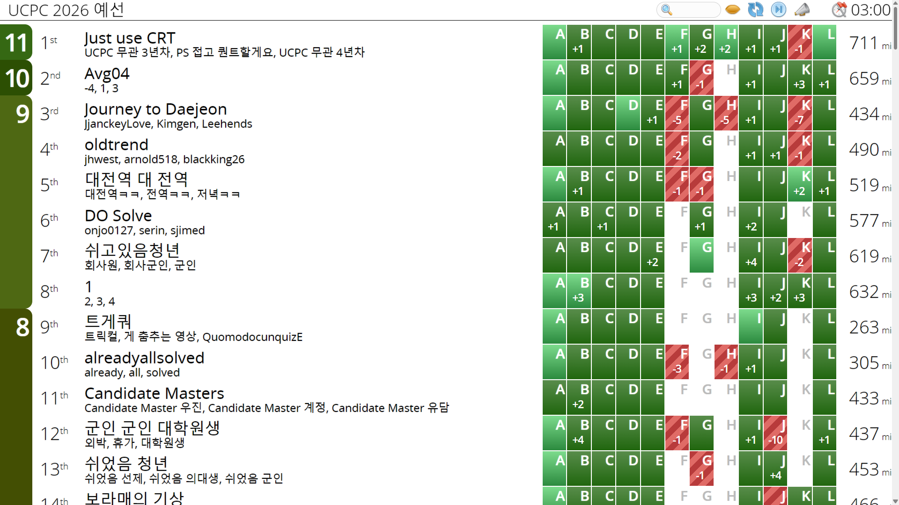

올해 UCPC는 [gs20036](https://codeforces.com/profile/gs20036), [ComPhyPark](https://codeforces.com/profile/comphypark)과 함께 출전했다. 지난 3년간은 내가 빡겜 팀을 구할 만큼 실력이 뛰어나지도 않고, UCPC는 약간 친한 친구들이랑 놀러 나가는 대회라고 생각을 했어서 높은 등수를 받지는 못했었다. 그러나 작년 UCPC가 끝나고 한 번쯤은 나도 수상권에 들고 싶다는 생각이 들어 2024 ICPC 팀원이었던 gs20036에게 함께 팀을 하자고 했다. 그렇게 2025 UCPC의 '세상에 나쁜 언어는 없다'팀의 annyeong1의 자리에 내가 들어가게 되었다.

처음으로 오렌지 이상의 팀원과 UCPC에 참가하는 거라 이번에는 등수에 대해 조금 기대가 있었다. 그렇게 예선 전에 팀 연습을 몇 번 했는데, ComPhyPark이 매번 압도적 퍼포먼스를 보여주었다. 감이 올듯 말듯한 문제를 잠깐 논의하면 본인이 풀 수 있을 것 같다면서 슥삭해오는 순간이 많았고, 역시 IGM 경험자는 다르구나 싶었다. 또한 gs20036 역시 군대를 갔음에도 압도적인 코딩 속도는 변하지 않았음을 확인했고, 풀이가 바로 나오는 문제의 경우 gs20036이 잡으면 보통 최상위권의 시간에 풀리는 모습을 보여주었다.

팀명은 '군인 군인 대학원생'으로 정했다. 대충 처음에 팀이 결성되고 만들어진 카톡방의 이름이었는데 딱히 더 좋은 아이디어가 생각나지 않아서 그렇게 확정했다. 팀원 닉네임은 '외박/휴가/나들이'로 하기로 했다.

## 타임라인

예선 시작 전에 Zoom의 이름을 대회 닉네임으로 해야 했는데, 감독관이 내 닉네임이 잘못되었다는 채팅을 보냈다. 알아보니 gs20036이 대회를 신청할 때 실수로 '외박/휴가/대학원생'으로 신청해버린 것이었다. gs20036을 비난하며 대회를 시작했다.

### 00:01:18

UCPC는 전통적으로 예선 A번에 브론즈 문제를 내기에, gs20036이 A부터 읽기로 했다. 역시 기대에 맞게 매우 빠르게 AC.

### 00:05:18

누가 풀었는지 모르겠지만 C에서 AC.

### 00:08:43

역시 누가 풀었는지 모르겠지만 D에서 AC.

### 00:14:43

스코어보드에서 E가 풀리고 있었지만 E부터 읽은 ComPhyPark이 잘 모르겠다고 했다. 내가 읽어보니 작년의 어느 백준 대회에서 푼 적이 있는 문제로 보였고, extra vertex를 놓고 MST를 구하는 문제라고 알려주었다. ComPhyPark이 구현해서 AC.

### 00:24:01

나는 I부터 읽었는데, 쉬울 것 같은 관상과 달리 바로 풀이가 보이지 않았다. gs20036에게 넘겼더니 증명이 안 된 풀이를 내고 00:16:31에 WA를 받아왔다. 해당 풀이에 대한 반례를 던졌더니 깨달은 gs20036이 고쳐서 AC.

### 00:57:24

gs20036이 B에서 그리디 풀이를 냈지만 내가 애매한 점을 잡았다. 그 다음 파라메트릭을 당연히 박으면 좋지 않을까 하는 이야기를 하다가 파라메트릭 + 그리디 풀이를 냈다. 내가 구현했지만 TLE가 나왔다. 대충 $O(N \log N \log 10^{15})$ 정도의 시간이 걸리는 풀이였기에 TLE가 날 만 해서 이것저것 작은 최적화를 시도했지만 3TLE를 받았다.

### 00:57:35

그 사이에 gs20036과 논의를 하던 ComPhyPark이 L에서 AC를 받았다. 출력 초과가 직전에 하나 찍혀 있는 것으로 보아 디버깅 코드를 안 지운 것 같다.

### 01:11:25

gs20036이 내 코드에서 버그를 발견했다. `long long`으로 `s`, `e`를 선언해놓고 `int m = (s + e) >> 1;`을 한 것이 문제였다. 마지막에 `-1`을 출력하는 분기를 빼먹어 1WA를 더 쌓고 AC.

### 01:26:43

내가 J를 풀었다 주장하고 코드를 제출했지만 WA. 대충 $O(N^2)$처럼 보이지만 유효한 상태가 $O(N)$개인 DP를 짰는데, 구현이 복잡해서 인덱스 에러 등이 아닐까 하고 디버깅을 시작했다.

### 02:17:06

ComPhyPark이 G에서 한 번에 AC를 받았다. 식 정리가 빡세서 오래 걸렸다고 하는데, 전체에서 6솔밖에 안 나온 문제를 슥삭해오는 것이 역시 신이라고 느꼈다.

### 02:57:50

J에서 마지막 제출을 했고 WA. J에서만 총 10개의 WA를 받았다. gs20036이 아예 다시 짜보기도 하고 나도 여러 버그를 수정하면서 시도했지만, 아쉽게 끝까지 고칠 수 없었던 것 같다.

...라고 생각했지만, 끝나고 내 코드를 LLM에게 넣으니 애초에 틀린 풀이를 냈던 것으로 판명이 났다. 에디토리얼 역시 아예 다른 방향의 풀이가 적혀 있었고, 7솔권 이상의 팀이 거의 다 푼 J를 끝까지 박아버린 트롤링을 한 꼴이 되었다.

## 후기

8솔, 437 페널티로 12등을 했다. B에서 페널티가 많이 쌓인 것도, J를 끝까지 못 푼 것도 내 잘못이라 미안한 마음이 들었다. B에서 처음부터 long long을 잘 쓰고 J를 올바르게 푸는 정도의 밥값만 했다면 5등 안에도 들었을 법한 결과가 나와서 아쉬웠지만, 나만 본선까지 폼을 올려놓으면 된다는 게 확인된 것 같아 앞으로 PS 재활을 좀 해보려고 한다.

[`나와-패트와매트-혹은-덤앤더머-비슷한-거`](https://blog.annyeong.one/posts/ucpc26p/)를 담당하고 있는 annyeong1을 이긴 걸로 만족하기로 하자.
