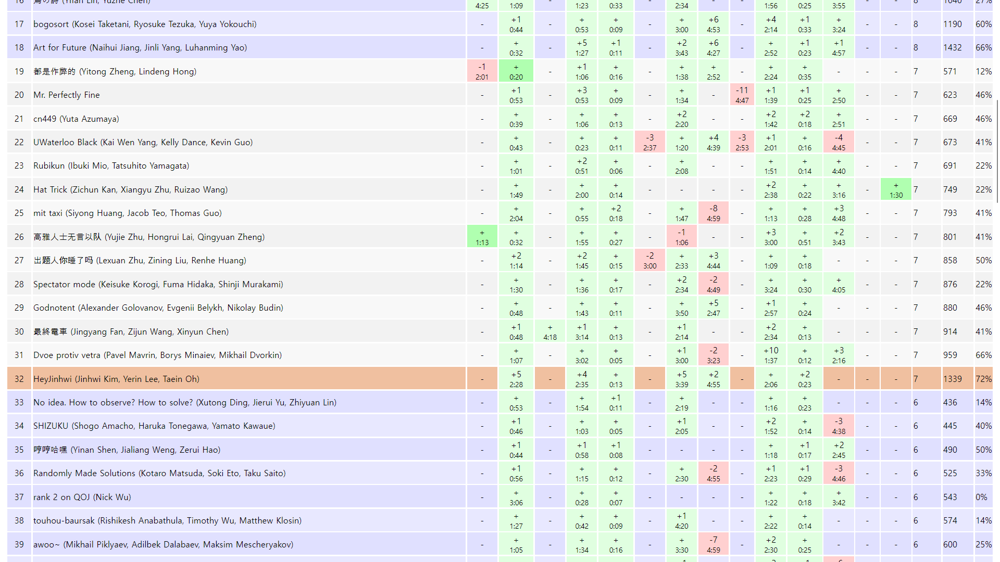

최근에 서울 리저널 규정이 정상화되면서 나는 내년 ICPC에도 나갈 수 있게 되었다(사실 내년에 나가지 않으면 2028년에도 나갈 수 있고, 높은 확률로 박사 과정일 것 같다...). 2024년에 팀이었던 gs20036이 전역을 하고 abra_stone이 학교를 오래 다닐 예정이라 우리의 라스트 댄스를 HeyJinhwi 어게인으로 하기로 했다.

내년에는 mhy908님이 전역을 하면서 songc와 함께하는 팀이 생길 예정이다. 또한 현 국대 중에 고3이 3명이며 국대 후보권에도 고3이 꽤 있는 것으로 알아 27학번에 고수가 들어올 확률이 존재한다. 게다가 parkky, flakepowders, ecubic 등 현 기준으로 나보다 폼이 좋은 사람이 상당히 많고, 마지막으로 올해 카이스트 외국인 팀 중에 IOI + IOI + WF 구성의 팀이 있다. 따라서 내년에 APAC를 가려면 현재보다 폼을 올려야 할 것으로 생각했다.

내가 내린 결론은 유컵 5를 지금부터 시작하는 것이었다. 마침 register를 받고 있었고, 빠르게 참가 의사를 모아 계정을 만들었다. 이후 디스코드에 들어가 보니 stage 1이 9월 19일이었고, 급하게 대회를 치게 되었다. 9월 19일에는 kokiri is cute 팀의 숭고한 연합대회가 있어서 빠르게 집에 돌아온 직후인 22시에 시작을 할 수밖에 없었다.

## 타임라인

### 0:13

시작하자마자 스코어보드에서 E가 풀렸다. 내가 A부터, gs20036이 E부터, abra_stone이 I부터 보기로 했고 gs20036은 초반을 잘 밀기 때문에 잠깐 기다렸지만 점호에 간 것 같았다. 그래서 내가 잡아서 AC.

### 0:23

gs20036이 스코어보드에서 풀리는 K를 2WA 후 AC.

### 2:06

이후 1시간 반 동안 AC가 없었다. 대충 B, D, J가 스코어보드에서 풀리길래 돌려가면서 잡았는데, 아마 J를 잡다가 내가 잠에 든 것 같다. 딱히 기억은 없는데 abra_stone의 증언으로는 내가 잔 적 없다고 하면서 자는 걸 자주 봤다고 한다. 아무튼 그 사이에 gs20036은 D에서 간단한 관찰을 하고 B와 D를 번갈아 보다가 B를 제출했지만 3WA, 1TLE. D 역시 abra_stone과 gs20036이 몇 가지 가설에 입각한 풀이를 제출해 보다가 2WA를 쌓았다. 그러다가 내가 정신을 차리고 J를 AC.

### 2:28

gs20036이 B에서 1TLE를 추가하고 AC. 대충 시복을 개선하던 과정에서 뭔가 자꾸 잘못되어서 아예 크게 갈아엎었다는 것 같다.

### 2:35

내가 D에서 아예 다른 접근을 했더니 문제가 매우 쉽게 풀렸다. 그런데 코드가 의문의 WA를 받았고, abra_stone이 `for (int i = 1; i <= n; i++) arr[x] = 0;`을 `for (int i = 1; i <= n; i++) arr[i] = 0;`으로 수정해 줘서 AC. 늘 주장하지만 나는 머리에 구멍이 하나 뚫린 오렌지(작년에는 머리에 구멍이 하나 뚫린 레드라고 주장했다)와 같은데, abra_stone이 마침 그 구멍에 딱 맞아서 팀 퍼포먼스가 잘 나오는 것 같다.

### 3:39

이후 스코어보드를 보니 인간컷 문제는 G밖에 남지 않은 것 같았다. gs20036이 풀이를 냈다고 주장했고, 나는 데이터가 랜덤이라는 조건을 보고 기여를 하지 않기로 했다. 2WA, 2RTE, 1TLE 끝에 AC.

### 4:55

gs20036이 G를 잡는 동안 나는 H를 잡았다. 대충 인간컷 위의 문제 중에 내가 풀 가능성이 높은 것은 기하이기 때문에 잡았는데, 역시 풀이는 10분 정도 만에 보인 것 같다. 볼록다각형 내의 점 판정을 얹은 투 포인터와 구간 스위핑, 레이지 세그를 모두 사용해야 하는 문제라서 구현에 자신이 없었지만 다행히 유컵은 LLM을 통한 검색이 허용되었다. 자세한 것은 [대회 규정](https://ucup.ac/rule/online-stage/#fair-use-of-generative-ai)을 보면 알 수 있다. 그래서 볼록다각형 내의 점 판정 코드를 외부에서 떼 와서 사용했고, 제출했으나 WA를 받았다. 실수를 사용해야 했기에 오차 핸들링을 좀 더 정밀하게 해 봤지만 WA였다. 그러다가 떼 온 코드의 출처가 post-BOJ 시대에 우후죽순 생긴 AI slop OJ의 자료라는 걸 깨닫고 믿을 수 있는 출처의 코드를 달라고 했고, AC.

## 후기

전체 32등으로 대회를 마무리했다. 5시간 온사이트 대회를 치고 온 컨디션이라 중간에 잤다는 점이 좀 아쉽지만 H를 풀어서 만족한다. abra_stone도 딱히 상태가 좋아 보이지는 않았어서 셋 다 풀 컨디션이었다면 패널티가 지금보다는 낮았을 것이라고 생각한다. 특히 최소한 D랑 J는 내가 1:00 내에 밀었어야 할 것 같다.

또한 아무리 검색이 허용되는 대회라고 하더라도 내 라이브러리를 어느 정도 구축할 필요성을 느꼈다. 제한된 프롬프트만 사용 가능한 상황에서 LLM이 신뢰도 높은 코드를 검색해 줄 것이라는 기대를 하기 어려움을 알았기 때문이다.

마지막으로, 셋에 기하가 나온다면 그래도 밥값 이상의 무언가를 할 수 있음이 한 번 더 입증돼서 개인적으로도 만족스러운 대회였다.

## 내가 푼 문제 풀이

### E. Easter Eggs

$n$개의 바구니가 있다. 계란이 하나씩 떨어진다. 계란이 하나 떨어질 때마다 원하는 만큼의 바구니를 잠글 수 있다. 계란은 잠그지 않은 바구니에 uniformly random하게 떨어진다. 목표는 $i < j$일 때 $i$번 바구니의 계란이 $j$번 바구니의 계란보다 strictly 적게 만드는 것이다. 목표를 달성하기 위해 필요한 계란 수의 기댓값을 구하여라.

대충 $0, 1, 2, \ldots, n-1$을 만들 수 있다면 행복하다. 생각해 보면 1번 바구니에 첫 계란이 떨어지지 않는 한 그냥 저렇게 만드는 것이 항상 가능하다. 1번 바구니에 첫 계란이 떨어진다면 $1, 2, \ldots, n-1$을 만들어야 한다. 따라서 $\frac{n-1}{n}$ 확률로 $\frac{n(n-1)}{2}$개, $\frac{1}{n}$ 확률로 $\frac{n(n+1)}{2}$개의 계란이 필요하다.

### J. Jaded Juice

용량이 $w$인 $n$개의 병 $A_1, \ldots, A_n$과 용량이 $2w$인 병 $B$가 있다. 병들에는 스티커가 붙어 있어 $A_i$는 안에 든 액체의 양이 $a_i$ 미만일 때만 그 양을 확실히 알 수 있고, $B$는 안에 든 액체의 양이 $w$ 초과일 때만 그 양을 확실히 알 수 있다. 처음에 모든 병에 $x$의 액체가 들어 있다. $A_i$의 액체를 $p$만큼 $B$에 넣는 시행을 통해 $x$를 알아내려면 최악의 경우에 최소 몇 번의 연산이 필요한가?

$A_i$에서 지금까지 $B$에 보낸 액체의 양을 $b_i$라고 하자. 이때, $A_i$를 통해 용량을 알아낼 수 있는 $x$의 범위는 $x-b_i < a_i$이다. $B$를 통해 용량을 알아낼 수 있는 $x$의 범위는 $x+\sum b_i > w$이다. 따라서 $\max\{a_i+b_i\} \le x \le w-\sum b_i$일 때만 $x$를 알아낼 수 없다. 그런데 $\max\{a_i+b_i\} = w-\sum b_i$일 때는 예외적으로 아직 알아내지 못했다는 사실로부터 $x$를 알아낼 수 있다. 즉, $\max\{a_i+b_i\}+\sum b_i \ge w$를 최대한 빨리 만드는 문제라고 할 수 있다.

또한 $A_i$에서 $B$에 보낼 수 있는 액체의 보장되는 용량은 $x-b_i \ge \max\{a_i+b_i\}-b_i$이다.

잘 정렬을 해서 $a_1 \ge a_2 \ge \cdots \ge a_n$이라고 하자. 이때 위 값을 빨리 키우기 위해서는 $a_1$을 $k$번 사용하고, $a_2, a_3, \ldots, a_l$번을 1번씩 사용하는 것임을 쉽게 확인할 수 있다. 엄밀히는 증명을 하지 않았지만 대충 수식을 적어 보면 될 것 같다. 이제 각 $l$에 대해 최소 $k$를 구할 수 있고, $\min\{k+l-1\}$이 답이 된다.

### D. Digesting

길이가 $n$이고 원소가 $1$ 이상 $n$ 이하인 수열이 주어진다. 이때 아래 시행을 $n-1$번 시행하여 남은 원소의 최댓값을 구하여라.

- 현재 수열의 길이를 $k$라고 하자. 길이 $k$의 순열 $p$를 하나 정한 뒤, $a_i$를 $a_i \bmod \max(a_{p_i}, 1)$로 동시에 바꾼다.
- 이후 원소 하나를 제거한다.

일단 시행을 하면 수열의 최댓값이 늘 줄어드므로 답은 $0$ 또는 $1$이다. 최종적으로 $1$이 될 조건을 생각해 보면, 길이가 $2$일 때는 $1, 2$를 가져야 한다. 이를 위한 조건을 생각해 보면 길이가 $3$일 때는 $2, 3$을 가져야 한다. 이렇게 역으로 수를 써 보며 규칙을 찾으면, 길이가 $n$일 때는 $\left\lfloor \frac{n+1}{2} \right\rfloor, \ldots, n$을 가져야 함을 알 수 있고 필요충분조건의 증명은 귀납법으로 쉽게 된다.

### H. Hockey Hog

볼록다각형 $B$ 내부에 볼록다각형 $A$가 있다. $A$의 점이 하나씩 쿼리로 들어올 때, 지금까지 쿼리로 들어온 점의 부분집합 $S$ 중 아래 조건을 만족하는 가장 큰 것의 크기를 구하여라.

- $S$의 모든 점 $v$에 전구를 놓는다. $v$에 놓인 전구는 $v$의 내각 쪽에만 빛을 비출 수 있다. 빛은 무한히 뻗어나간다. 즉 한 전구가 만드는 빛의 영역은 두 반평면의 교집합이다. 이때, 모든 전구가 빛을 비추는 영역 중 $B$의 외부에 있는 점이 존재한다.

복잡해 보이지만 풀이는 아주 쉽다. Cyclic한 order로 생각했을 때, $A$의 꼭짓점 $i$부터 $j$까지에 전구를 놓았을 때 위 조건을 만족하는 최대 $j$를 $i$마다 구해 놓고 대충 $r_i$라 하자. 그러면 대충 모든 $i$에 대한 구간 $[i, r_i]$를 늘어놓았을 때 조금씩 밀리는 형태가 된다. 이때 어떤 $j$에 대해 $[i, r_i]$가 $j$를 포함하는 $i$를 모은 집합을 $X_j$라고 해 보자. 그러면 $X_j$도 cyclic하게 연속한 구간을 이룸을 알 수 있다. 즉, 처음에 모두 $0$인 수열 $t$에서 시작해 쿼리에서 $u$가 들어오면 $X_u$의 모든 원소 $v$에 대해 $t_v$에 $1$을 더하고, 전역 최댓값을 구하는 문제가 된다. 이는 레이지 세그로 쉽게 구할 수 있다. $r_i$를 구할 때 투 포인터 + 볼록다각형 내 점 판정이 사용된다.
